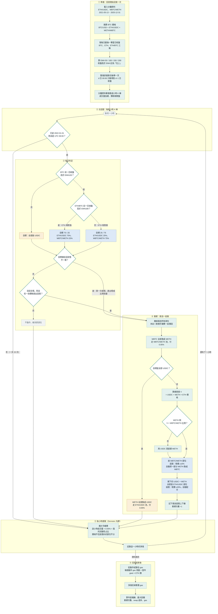

# BTC／ETH 三池連動策略研究報告

日期：2026-09-30（2026-10-01 更新：新增第 7–9 節：策略改進、起始月份敏感度、ETH 單獨下跌的防護）
分支：`joy/my-strategy`（從 `remix` 分出，含 `defense_v6`）
回測框架：Demeter（Uniswap v3 LP 回測）

---

## 摘要

- **v6 回測可在本機重現**：用外部提供的歷史資料跑 `gamma_ig_gap_bands_defense_v6.py`，2025 年結果與分支文件一致（+16.55% 對比文件 +16.6%）。
- **BTC 在鏈上分鐘資料中沒有可交易的領先性**：分鐘、小時級都沒有，波動外溢也沒有額外資訊。唯一的線索是日線的 BTC 趨勢，但統計上不顯著。
- **BTC–穩定幣池的歷史資料品質不足**：2022–2024 年幾乎沒有交易量。所以改用「方案 A」：BTC 價格由 ETH/USDC × WBTC/WETH 換算，只在這兩個流動性好的池子做 LP。
- **三池濾網策略的結論**：
  - ✅ **加趨勢濾網、區間 ±20% 以上**在所有參數組合下都成立，大幅降低回撤。
  - ✅ **依 ETH/BTC 趨勢調整兩池比例（tilt_follow）**是最穩定的元件：樣本外 40/52 次贏過固定比例。但這四年 ETH/BTC 都在走弱，還沒在反向行情中驗證過。
  - ⚠️ **「BTC 濾網優於 ETH 濾網」只靠 2022 年一次事件支持**，其他年份兩者差不多。
  - ⚠️ **本質是熊市保險**：整段 2022–2025 贏過持有，但在 2023–2025 多頭期間遠遠輸給單純持有 BTC 或 ETH。
- **策略改進（第 7 節）**：
  - ✅ **小幅遲滯（1%）**：重建次數從 106 降到 74，成本少約 $4k，最大回撤從 −35% 改善到 −31%。
  - ✅ **濾網關閉時停泊到 USDC/USDT**：扣掉脫鉤期間的模擬假象後，4 年約多 7 pt。
  - ❌ **每小時檢查出界反而變差**：報酬少 24 pt，回撤擴大到 −39%。
  - 目前最好的組合是「停泊 + 遲滯 1% + 每日檢查」：+154%、回撤 −31%（基準為 +143%、−35%）。但這組是事後挑選的，差距也還不足以證明。
- **起始月份敏感度（第 8 節）**：37 個起點的年化全部為正（+10% 到 +44%），「停泊 + 遲滯 1%」在每個起點都贏過基準；跟持有 50/50 比大約各贏一半。
- **主要風險（第 9 節）**：ETH 單獨下跌時（2024-12 到 2025-03），BTC 濾網保護不到，回撤約 −31%。用 ETH 自己的 EMA 來防護試了三種做法，都沒用，而且在其他年份代價很大，所以不採用。

---

## 1. 資料與環境

### 1.1 資料來源

歷史資料來自外部提供的壓縮檔（`sample拷貝.zip`，約 700 MB），內容是 11 個 Uniswap v3 池子的分鐘級 CSV，格式與 [demeter-fetch](https://github.com/zelos-alpha/demeter-fetch) 產出的相同。解壓到 `samples/real-data/<pool address>/`，這個路徑已被 `.gitignore` 排除。

本研究用到的三個池子：

| 池子 | 交易對 | 手續費 | 資料期間 | 用途 |
|---|---|---|---|---|
| `0x88e6a0c2…f5640` | USDC / WETH | 0.05% | 2021-05-05 ~ 2026-01-04 | ETH 價格、LP 第一條腿 |
| `0x4585FE77…5a20c0` | WBTC / WETH | 0.05% | 2021-05-06 ~ 2026-01-17（缺 2021-05-12） | ETH/BTC 匯率、LP 第二條腿 |
| `0x56534741…9A83b2` | WBTC / USDC | — | 2021-06-11 ~ 2026-02-20（2024–25 缺 8 天） | 只用於領先落後分析 |
| `0x3416cF6C…3527C6` | USDC / USDT | 0.01% | 2021-11-15 ~ 2025-12-31（無缺日） | 第 7 節：濾網關閉時的停泊池 |

zip 內其餘池子：DAI/USDT、wstETH/ETH、WBTC/cbBTC、WBTC/WETH 0.3%，以及三個 Arbitrum 池。

### 1.2 資料品質

| 年份 | ETH/USDC 日交易量中位數 | BTC/USDC 日交易量中位數 | WBTC/WETH 日交易量中位數 | 有交易的分鐘比例（ETH／BTC／比率） |
|---|---|---|---|---|
| 2022 | $546M | ≈ $0 | $70M | 96% / 0% / 37% |
| 2023 | $226M | ≈ $0.01M | $27M | 93% / 1% / 32% |
| 2024 | $209M | ≈ $0 | $51M | 96% / 8% / 44% |
| 2025 | $104M | $15.9M | $20M | 93% / 46% / 59% |

**BTC/USDC 池在 2025 年之前幾乎是死池**，2024–2025 年最長有約 2.5 天沒有任何交易。這決定了後續採用方案 A。

---

## 2. 嘗試一：重現 v6 回測

在 `remix` 分支上，用預設設定跑 `gamma_ig_gap_bands_defense_v6.py`（2025 全年、100,000 USDC、每日判定），約 7 分鐘完成。

| 項目 | 分支文件（2026-09-29） | 本機重跑 |
|---|---|---|
| 報酬率 | +16.6% | +16.55% |
| 本金（LP 淨值） | $95.1k | $95,079 |
| 手續費收入 | $20.8k | $20,781 |
| swap 成本 | $556 | $556.43 |
| ETH 持有報酬（池價） | −11% | −10.9% |

**結論**：資料和環境都正確，可以作為後續研究的基準。

---

## 3. 嘗試二：BTC 是否領先 ETH？

程式：[`samples/research/btc_lead_eth.py`](../samples/research/btc_lead_eth.py)
資料：2024–2025 年，三個池子的分鐘價格

### 3.1 領先落後相關性（lag 為 1 根 K 棒）

| K 棒 | 同期相關 | BTC→ETH | ETH→BTC |
|---|---|---|---|
| 1 分 | 0.300 | 0.038 | **0.107** |
| 15 分 | 0.491 | 0.018 | **0.082** |
| 60 分 | 0.556 | 0.000 | **0.089** |
| 1 日 | 0.776 | −0.027 | −0.039 |

**反而是 ETH 領先 BTC 池**。這是因為 BTC 池交易稀少、價格更新慢，屬於套利時間差造成的假象，不是市場真的誰先動。

### 3.2 事件研究：BTC 在 15 分鐘內大漲或大跌之後

| BTC 變動 | 事件數 | ETH 之後 15 分 | 60 分 | 240 分 | 跟隨機率 |
|---|---|---|---|---|---|
| > 1% | 944 | +3.6 bps | +0.3 bps | +7.9 bps | 46–50% |
| > 1%，且 ETH 當下沒跟 | 407 | +1.4 bps | −0.6 bps | +4.6 bps | 46–50% |

**ETH 不會補漲或補跌**，幅度遠小於 0.05% 的交易成本。

### 3.3 波動外溢

- 預測 ETH 下一小時的波動時，加入 BTC 波動，R² 只從 0.503 升到 0.505。
- 未來 4 小時 ETH 漲跌超過 3% 的機率：
  - 平常：6.6%
  - BTC 波動暴增：10.3%
  - BTC 暴增但 ETH 平靜：6.4%，跟平常一樣
  - ETH 自己波動暴增：12.0%

**BTC 的警訊在 ETH 自己的波動裡已經看得到。**

### 3.4 日線趨勢（唯一的線索）

| 前一日收盤的狀態 | 天數 | ETH 隔日平均報酬 |
|---|---|---|
| BTC 在 EMA100 之上 | 516 | +0.13% |
| BTC 在 EMA100 之下 | 215 | −0.19% |
| ETH 在 EMA100 之上 | 414 | +0.11% |
| ETH 在 EMA100 之下 | 317 | −0.07% |

用 BTC 趨勢區分好壞日子比用 ETH 自己的趨勢略清楚，但 t 值約 1，**不顯著**。

---

## 4. 策略設計：方案 A

因為 BTC–穩定幣池的資料不足，改採：

- **BTC/USD 價格** = ETH/USDC × WETH/WBTC，從 2021-05 起有連續資料。
- **只在兩個流動性好的池子做 LP**：ETH/USDC 0.05% 和 WBTC/WETH 0.05%。

策略程式：[`samples/strategy-example/tri_btc_eth_gate.py`](../samples/strategy-example/tri_btc_eth_gate.py)

### 4.1 規則（每日 UTC 00:00，依前一日收盤判定）

1. **濾網（gate）**：決定資金放進池子，還是全數換回 USDC。
   - `none`：永遠在場
   - `btc`：換算出的 BTC 收盤價 > EMA
   - `eth`：ETH 收盤價 > EMA
   - `both`：上面兩個條件都成立
2. **兩池比例**：
   - 固定：各一半
   - `follow`：ETH/BTC 在 EMA 之上（ETH 相對強）時，兩池比例為 75/25（ETH/USDC／WBTC/WETH），否則為 25/75
   - `fade`：與 follow 相反
3. **區間**：預設 ETH/USDC 為現價 ±20%，WBTC/WETH 為 ±10%。
4. **重建時機**：目標狀態改變，或價格超出任一條腿的區間時。
5. **選用的改進（第 7 節）**：
   - 停泊：濾網關閉時，把 USDC 放進 USDC/USDT ±0.5%
   - 遲滯：訊號要超過 EMA ±b 才切換
   - 每小時檢查出界

### 4.2 完整流程圖

以 `btc100_follow` 為主線。其他組合只在「濾網」和「比例」兩個判斷不同：濾網可換成 ETH、兩者都要成立或不過濾；比例可改成固定 50/50（跳過 ETH/BTC 判斷）或 fade（75/25 與 25/75 對調）。



流程中容易忽略的細節：

1. **每個池子同時只有一個部位**：區間內流動性均勻分布，不是 v6 那種 8+8 共 16 段的階梯。
2. **出界一天只檢查一次**：白天價格跑出區間，要等隔天 00:00 才會重建。這段時間部位全部是單一幣種，也分不到手續費。
3. **比例一變，兩池就全部重建**：follow 和 fade 每切換一次，都是一次完整重建的成本。tilt 版本重建了 106 次，固定 50/50 是 78 次。
4. **目標是 USDC、而且本來就在 USDC 時不會動作**，不產生任何成本。
5. **手續費會複利**：撤部位時手續費跟本金一起領回，下次重建全部放回池子。v6 則是領到手續費就賣成 USDC，不再投入。
6. **區間邊界會對齊 tick**：±20% 和 ±10% 是以重建當下的價格計算，再對齊池子的 tick 間距，所以實際寬度會有些微誤差。

### 4.3 成本與模擬設定

- **swap**：付池子手續費 0.05%，不計滑價。
- **gas**：事後從 Demeter 的動作紀錄估算，算法是「各動作 gas 用量 × 當年平均 gas 價格 × ETH 價格」。

| 動作 | gas 用量（假設） |
|---|---|
| 新增流動性 | 450k |
| 移除流動性 | 150k |
| 領取手續費 | 120k |
| swap | 130k |

| 年份 | 2021 | 2022 | 2023 | 2024 | 2025 |
|---|---|---|---|---|---|
| gas 價格（假設，gwei） | 50 | 40 | 30 | 15 | 3 |

  這些都是粗估，不是實測值。
- **手續費分母修正（第 7 節起）**：Demeter 計算手續費占比時，用的是「我的流動性 ÷ 池子鏈上流動性」，分母沒有算進自己的部位。在池子很深時影響很小，但在流動性稀薄的價位（例如 2023/3 USDC 脫鉤時的 USDC/USDT 池）會大幅高估手續費。所以策略程式在載入時把它改成「我的流動性 ÷（池子流動性 + 我的流動性）」。這個修改只影響這支程式，不動 Demeter 核心，也不影響 v6。修正後，基準 btc100_follow 從 +144.4% 變為 +143.2%，固定 50/50 從 +83.7% 變為 +82.8%。第 5、6 節的數字是修正前跑的，大約高估 1 pt。
- **模擬粒度**：以小時 K 棒回測，分鐘資料用 Demeter 內建規則重新取樣。訊號使用分鐘級的日收盤價。
- **期間**：2021-05-13 到 2021-12-31 只用來暖身 EMA，實際交易期間為 2022-01-01 ~ 2025-12-31。

---

## 5. 嘗試三：參數穩健性、區間、tilt、gas

結果檔：`samples/strategy-example/result/tri-gate/summary.csv`（17 組）。

以下都是**扣除估算 gas 後**的結果，初始資金 100,000 USDC。

### 5.1 EMA 週期 × 濾網（兩池各半）

| EMA | BTC 濾網 | ETH 濾網 | 兩者都要成立 |
|---|---|---|---|
| 50 | +56.3% | +19.5% | +42.1% |
| 100 | +83.7% | +22.5% | +60.2% |
| 150 | +102.0% | +69.0% | +106.8% |
| 200 | +42.8% | +68.7% | +61.6% |
| 不過濾 | −8.0%（回撤 −66.5%） | | |
| *持有 50% BTC、50% ETH* | *+34.9%（回撤 −69.7%）* | | |

- 12 組有濾網的全部賺錢，最大回撤介於 −20% 和 −41% 之間。
- 4 個週期裡 3 個是 BTC 濾網勝，EMA200 是 ETH 濾網勝。
- 同樣是 BTC 濾網，報酬從 +43% 到 +102% 都有，**對週期很敏感**。

### 5.2 區間寬度（BTC 濾網、EMA100）

| 區間（ETH/USDC ／ WBTC/WETH） | 4 年合計 | 重建次數 | swap 加 gas 成本 |
|---|---|---|---|
| ±10% ／ ±5% | +33.7% | 139 | $16.0k |
| ±20% ／ ±10% | +83.7% | 78 | $9.2k |
| ±30% ／ ±15% | +83.6% | 67 | $7.7k |

### 5.3 依 ETH/BTC 趨勢調整比例（BTC 濾網、EMA100）

| 做法 | 2022 | 2023 | 2024 | 2025 | 合計 | 最大回撤 |
|---|---|---|---|---|---|---|
| tilt_follow | +0.6% | +44.1% | +50.1% | +16.2% | **+144.4%** | −35.0% |
| 固定各半 | −1.3% | +39.2% | +35.3% | +1.5% | +83.7% | −30.5% |
| tilt_fade | −5.3% | +33.0% | +30.6% | −1.6% | +58.4% | −27.8% |

### 5.4 對照：持有

| | 2022 | 2023 | 2024 | 2025 | 合計 | 最大回撤 |
|---|---|---|---|---|---|---|
| 持有 BTC | −64.2% | +163.8% | +123.8% | −6.2% | +88.9% | −67.6% |
| 持有 ETH | −67.3% | +95.3% | +47.1% | −10.8% | −19.2% | −76.8% |
| 持有 50% BTC、50% ETH | −65.8% | +131.1% | +92.8% | −7.7% | +34.9% | −69.7% |

### 5.5 gas

四年合計 $2.9k–8.1k，大部分發生在 2022–2023 年。2025 年的 gas 價格假設只有 3 gwei，影響幾乎可以忽略。

### 5.6 分鐘級驗證（2025 年，從 1/1 重新開始）

結果檔：`minute_check_2025-01-01.csv`

| 策略 | 小時級 | 分鐘級 |
|---|---|---|
| mix_btc100 報酬／最大回撤 | +0.1% ／ −27.0% | −0.8% ／ −35.2% |
| mix_none 報酬／最大回撤 | −6.1% ／ −42.4% | −7.6% ／ −44.0% |

- 兩種粒度的重建次數與成本完全相同，交易決策一致。
- 小時級每年大約**高估報酬 1–1.5 pt**。
- 小時級**明顯低估最大回撤**：分鐘級的瞬間暴跌會被小時 K 棒抹平。

---

## 6. 嘗試四：Walk-forward 驗證

程式：[`samples/research/walk_forward.py`](../samples/research/walk_forward.py)
候選：39 組，由 {none, btc, eth, both} 濾網 × {50, 100, 150, 200} EMA 週期 × {固定, follow, fade} 組成。不過濾時不需要週期，只有 3 組。區間固定為 ±20%／±10%。
結果檔：`nav_grid.csv`、`walk_forward_picks.csv`、`walk_forward_summary.csv`

採用擴張視窗：用 2022 年選參數測 2023 年，用 2022–23 年選參數測 2024 年，用 2022–24 年選參數測 2025 年。

### 6.1 每年選到的組合（依訓練期報酬挑選）

| 測試年 | 選到 | 測試年報酬 | 在 39 組中的排名 | 中位數 | 當年最佳 |
|---|---|---|---|---|---|
| 2023 | btc150_follow | +35.1% | 24／39 | +37.4% | +93.2%（不過濾） |
| 2024 | btc100_follow | +50.1% | 1／39 | +28.5% | +50.1% |
| 2025 | btc100_follow | +16.2% | 8／39 | +9.5% | +23.5% |

### 6.2 樣本外合計（2023–2025）

| 策略 | 2023–25 | 最大回撤 |
|---|---|---|
| walk-forward（依報酬挑選） | +135.6% | −34.4% |
| walk-forward（依 Calmar 挑選） | +99.1% | −33.1% |
| 隨便挑一組（中位數） | +93.3% | — |
| 事後最佳 | +258.1% | — |
| 持有 50% BTC、50% ETH | +295.6% | −41.6% |
| 持有 BTC | +429.6% | −35.3% |

### 6.3 各元件在樣本外是否一致

**tilt 贏過固定比例的次數**（13 組濾網 × 週期組合）：

| | 2022 | 2023 | 2024 | 2025 | 合計 |
|---|---|---|---|---|---|
| follow | 13/13 | 6/13 | 10/13 | 11/13 | 40/52 |
| fade | 1/13 | 0/13 | 3/13 | 0/13 | 4/52 |

**各濾網的年度報酬中位數**：

| | 2022 | 2023 | 2024 | 2025 |
|---|---|---|---|---|
| BTC | −3.1% | +36.3% | +30.1% | +11.8% |
| ETH | −22.3% | +39.0% | +25.9% | +11.9% |
| 兩者都要成立 | −4.5% | +35.1% | +26.2% | +3.1% |
| 不過濾 | −62.5% | +85.1% | +38.3% | −5.2% |

---

## 7. 嘗試五：策略改進（停泊、遲滯、每小時檢查）

程式：`tri_btc_eth_gate.py --improve`
結果檔：`summary_improve.csv`、`nav_improve.csv`

以 walk-forward 選出的 `btc100_follow` 為基準，三項改進先分別測試，再組合起來測。

### 7.1 三項改進

1. **停泊**：濾網關閉時，把 USDC 放進 USDC/USDT 0.01% 池（`0x3416…`），區間 ±0.5%。另外加上保護：USDT/USDC 偏離 1 達 0.3% 以上時不停泊，資金留在 USDC，等價格回到正常再放回去。
2. **遲滯區間**：訊號要漲破 EMA × (1 + b) 才轉為「在上」，跌破 EMA × (1 − b) 才轉為「在下」，中間維持原本狀態。濾網和 tilt 都套用。測試 b = 1%、2%、5%。
3. **每小時檢查出界**：切換的判定仍只在 00:00 做，但每小時檢查一次是否出界，出界就重新置中。

### 7.2 結果（2022–2025，已扣估算 gas）

| 組合 | 4 年合計 | 扣掉 2023/3 假象 | 最大回撤 | 重建次數 | swap + gas 成本 |
|---|---|---|---|---|---|
| 基準 follow_base | +143.2% | — | −35.0% | 106 | $14.0k |
| 停泊 | +157.0% | +150.2% | −35.1% | 110 | $16.0k |
| 遲滯 1% | +146.1% | — | −31.2% | 74 | $10.0k |
| 遲滯 2% | +128.5% | — | −31.8% | 66 | $8.7k |
| 遲滯 5% | +136.9% | — | −32.0% | 52 | $6.5k |
| 每小時檢查 | +119.5% | — | −39.3% | 116 | $14.7k |
| 停泊 + 遲滯 2% | +142.3% | — | −31.6% | 70 | $10.0k |
| 三項全開（遲滯 2%） | +122.3% | +114.3% | −34.2% | 94 | $11.4k |
| **停泊 + 遲滯 1%（每日檢查）**＊ | **+160.8%** | **+154.1%** | **−31.2%** | 78 | $11.5k |
| 固定 50/50 基準 | +82.8% | — | −30.5% | 78 | $9.2k |
| 固定 50/50 三項全開 | +84.7% | +81.3% | −31.9% | 86 | $9.0k |

＊看過其他結果後才補跑的組合，屬於事後挑選。

「扣掉 2023/3 假象」的算法：把 2023 年 3 月的逐小時報酬，換成同設定但沒有停泊的版本，見 7.4。

逐年報酬：

| 組合 | 2022 | 2023 | 2024 | 2025 |
|---|---|---|---|---|
| 基準 | +0.6% | +44.1% | +49.9% | +15.8% |
| 停泊 | +2.0% | +49.4% | +50.6% | +15.8% |
| 遲滯 1% | +2.8% | +39.3% | +47.7% | +20.4% |
| 遲滯 5% | −8.5% | +48.5% | +34.5% | +33.9% |
| 每小時檢查 | +0.6% | +47.9% | +37.0% | +11.3% |
| 停泊 + 遲滯 1% | +4.7% | +44.2% | +48.3% | +20.5% |

### 7.3 解讀

1. **停泊有幫助，但幅度小**：扣掉脫鉤假象後，4 年大約多 7 pt，平均每年約 1.5 pt。主要來自濾網關閉天數最多的 2022 年。
2. **遲滯可靠的好處是降低成本和回撤**：重建次數少 30–50%，回撤改善約 3–4 pt。但總報酬沒有一致的方向，1% 最好、2% 最差、5% 又回升。逐年來看差異很大，代表遲滯主要是改變了切換的日期，報酬差異很大程度是運氣。所以建議用小的遲滯（1%）。
3. **每小時檢查出界反而變差**：價格一出界就在極端價位重建，價格回頭時等於把無常損失鎖死，還多付了重建成本。每日檢查一次，反而給了價格回到區間的時間。「出界要盡快處理」這個直覺在這裡不成立。
4. **目前最好的組合是停泊 + 遲滯 1% + 每日檢查**：扣掉假象後 +154%、回撤 −31%，基準是 +143%、−35%。但這組是事後挑選的，約 10 pt 的差距在四年資料上還不足以證明。

### 7.4 USDC 脫鉤（2023/3）的模擬問題

停泊版本在 2023 年 3 月出現不合理的超額報酬。追查後發現兩個原因：

1. **分母沒有算自己的流動性**：見 4.3 的「手續費分母修正」。修正後，第一季的超額報酬從 +5.8 pt 降到 +4.2 pt。
2. **成交量歸屬的假象**：3/11 價格從 1.008 一路衝到 1.10，穿過我窄窄的 ±0.5% 區間，而當天的成交量是數十億美元。Demeter 會依「價格路徑在我區間內的比例」，把整根 K 棒的成交量算給我。但實際上，價格穿越一次最多只能換掉我手上約 $52k 的 USDT，只會產生幾美元的手續費，模型卻記了約 $3,800。

| 2023 年 3 月，停泊減掉不停泊 | 小時級 | 分鐘級 |
|---|---|---|
| 超額報酬 | +3.9 pt | +1.1 pt |

就算用分鐘級，模型也還是假設成交量全部經過我的區間，所以實際的好處應該更小。

因此加上了「偏離 0.3% 就不停泊」的保護（`PARK_MAX_DEPEG`）。但脫鉤剛開始的那幾個小時仍會落在這個假象裡，所以 7.2 另外列出「扣掉 2023/3 假象」的數字作為參考。

---

## 8. 嘗試六：起始月份敏感度

程式：`tri_btc_eth_gate.py --starts`
結果檔：`starts_summary.csv`
互動頁面：起始月份圖表與每月報酬熱圖已發布為 artifact（私人連結，需要從頁面的 Share 選單開放權限才能分享）。

做法：從 2022-01 到 2025-01，每個月 1 日各起跑一次，共 37 個起點，全部跑到 2025-12-31。每個起點都從 100,000 USDC 開始，並扣除估算 gas。持有組合從同一天買入，持有到期末。

### 8.1 37 個起點的年化報酬

| 策略 | 年化中位數 | 最差起點 | 最好起點 | 年化為正 | 贏過持有 50/50 | 最大回撤中位數 |
|---|---|---|---|---|---|---|
| 停泊 + 遲滯 1% | +31.5% | +10.2%（2024-04） | +43.6%（2023-10） | 37 / 37 | 21 / 37 | −31.2% |
| 基準 btc100_follow | +29.2% | +7.9%（2024-12） | +41.9%（2023-10） | 37 / 37 | 19 / 37 | −34.9% |
| 固定 50/50 | +17.5% | −2.9%（2024-12） | +25.9%（2023-11） | 34 / 37 | 7 / 37 | −30.4% |
| 持有 50% BTC + 50% ETH | +31.1% | −13.5%（2024-12） | +57.3%（2023-01） | 35 / 37 | — | −44.5%（最差 −69.7%） |
| 持有 BTC | +45.7% | −8.5%（2024-12） | +74.4%（2023-01） | 35 / 37 | 37 / 37 | −35.3%（最差 −67.6%） |

### 8.2 解讀

1. **策略的結果不太受起點影響**：停泊 + 遲滯 1% 在每個起點都賺錢，年化介於 +10% 到 +44%。持有 50/50 則從 −13.5% 到 +57.3% 都有。
2. **改進版在 37 個起點全部贏過基準**，年化多 1–4 pt。2023-04 之後起跑的 22 個起點完全避開了 USDC 脫鉤，也全部勝出，所以第 7 節的改進不是靠特定起點，也不是靠脫鉤期間的假象。
3. **跟持有 50/50 比大約各贏一半**：
   - 策略勝：2022-01 到 2022-06 起跑（熊市中進場），以及 2023-11 之後起跑
   - 持有勝：2022-07 到 2023-10 起跑（在低點附近進場，接著碰上多頭）

   兩者的中位數幾乎一樣，但策略的最差情況好很多。
4. **幾乎每個起點的最大回撤都是約 −31%，而且來自同一段下跌**：2024-12-16 到 2025 年 2–3 月。這段期間 ETH 從約 $4,000 跌到約 $2,100，但 BTC 一直在 EMA 之上，所以 BTC 濾網沒有關閉。這是 BTC 濾網的盲點：只有 ETH 大跌時保護不了。第 9 節針對這點做了測試。
5. **固定 50/50 明顯較弱**：只有 7 / 37 個起點贏過持有 50/50。用 ETH/BTC 調整比例（follow），在所有起點都有幫助。

---

## 9. 嘗試七：ETH 單獨下跌的防護

程式：`tri_btc_eth_gate.py --ethguard`
結果檔：`summary_ethguard.csv`、`nav_ethguard.csv`

針對第 8 節發現的盲點，在「停泊 + 遲滯 1%」上測試三種防護方式。這三種都是看到那段下跌之後才設計的，所以重點是看它們在其他年份要付出多少代價。

| 方式 | 規則 |
|---|---|
| both | BTC 和 ETH 都要在 EMA 之上才進場，任何一個跌破就全部出場 |
| half | 維持 BTC 濾網，但 ETH 跌破自己的 EMA 時只投入一半，另一半停泊到穩定幣池（`eth_weak_scale=0.5`） |
| eth | 只看 ETH 自己的濾網，作為對照 |

### 9.1 結果（2022–2025，已扣估算 gas）

| 方式 | 2022 | 2023 | 2024 | 2025 | 4 年合計 | 最大回撤 | 2024-12-16 ~ 2025-03-04 |
|---|---|---|---|---|---|---|---|
| **停泊 + 遲滯 1%（不加防護）** | +4.7% | +44.2% | +48.3% | +20.5% | **+160.8%** | −31.2% | −22.7% |
| both | +4.7% | +36.0% | +21.1% | +4.2% | +73.7% | −32.0% | −22.3% |
| half | +4.7% | +39.0% | +26.9% | +12.2% | +100.1% | −31.7% | −22.7% |
| eth | −23.5% | +48.7% | +17.9% | +8.1% | +40.1% | −34.2% | −22.6% |

### 9.2 解讀

1. **三種防護都沒有擋住這段下跌**，期間損失都在 −22% 到 −23%，和沒有防護時差不多。原因是 ETH 自己的 EMA 訊號在 EMA 附近反覆切換：
   - ETH 直到 2025-01-10 才跌破 EMA，那時已經是高點後將近一個月。
   - 之後到 2/2 為止又來回切換了 6 次，最後一次重新進場，正好碰上 2/3 的暴跌。
   - 2024 全年，ETH 訊號切換了 14 次。每次切換都要付一次完整重建的成本，還常常碰上短線反轉。
2. **其他年份付出很大的代價**：2024 年從 +48% 降到 +18%～+27%，4 年合計從 +161% 降到 +40%～+100%。最大回撤也沒有改善。both 和 eth 的回撤甚至變成 2024-03 到 2025-05 的長期下滑。
3. **結論：三種防護都不採用。**「ETH 單獨下跌時約 −31% 的回撤」是這個策略已知的風險。
4. **一條線索，但不建議追**：ETH/BTC 的 tilt 訊號在 2024-12-10、高點前一週，就已經判斷 ETH 轉弱，策略也已經轉為 25/75。但 WBTC/WETH 池本身仍約有一半是 ETH，所以保護有限。若改成「ETH/BTC 弱時只投入一半」，因為 2022–2025 年 ETH/BTC 大多數時間都偏弱，等於多數時間都會降低曝險，而且這個點子也是看了這段下跌才想出來的。在用 2017–2021 年資料驗證之前，不建議採用。

---

## 10. 結論

### 可以相信的

1. **趨勢濾網能大幅降低回撤**。所有參數組合都成立，2022 年的結果從不過濾的 −62.5%，改善到 +0.7% 至 −33.8% 之間。
2. **區間要夠寬**。±10% 會因頻繁重建而吃掉報酬，±20% 以上差異不大。
3. **挑選流程有一定作用**。walk-forward 比隨便挑多了約 42 pt，而且 2024 年以後穩定選到 btc100_follow。
4. **小幅遲滯可以降低成本和回撤**。三種遲滯都讓重建次數減少 30–50%，回撤改善約 3–4 pt。
5. **出界不要每小時就處理**。每小時檢查讓報酬和回撤都變差。
6. **策略結果對起始月份不敏感**：37 個起點年化全部為正（+10% 到 +44%）。「停泊 + 遲滯 1%」在每個起點都贏過基準。
7. **不要用 ETH 自己的 EMA 來防 ETH 單獨下跌**：訊號太晚、太容易來回切換，三種做法都沒擋住下跌，其他年份還付出很大代價。

### 有希望但未被證明的

8. **停泊到穩定幣池**：正常期間大約每年多 1.5 pt。但脫鉤事件模型模擬不準，脫鉤期間的風險無法從回測評估。
9. **停泊 + 遲滯 1% 的組合**：+154%、回撤 −31%，目前最好。它是事後挑選的，但起始月份測試顯示它的優勢很穩定。
10. **tilt_follow**：樣本外 40/52 次贏過固定比例，fade 則幾乎都輸，顯示 ETH/BTC 匯率有動能。**但 2022–2025 年 ETH/BTC 每年都在走弱**，還沒在 ETH/BTC 長期走強的行情中驗證過。
11. **BTC 濾網優於 ETH 濾網**：只有 2022 年差很多，2023–2025 年幾乎相同，**證據只有一次事件**。

### 策略的定位

12. **這是熊市保險，不是增強報酬的工具**：
   - 看完整一輪 2022–2025：btc100_follow +144%、回撤 −35%，優於持有 BTC（+89%、−68%）和持有 50/50（+35%、−70%）。
   - 只看多頭期 2023–2025：落後持有 BTC（+430%）和持有 50/50（+296%）很多，最大回撤也沒有比持有 BTC 小。
   - 換不同起點來看（第 8 節）：年化中位數跟持有 50/50 幾乎相同，大約各贏一半，但最差情況好很多。
13. **已知的主要風險是 ETH 單獨下跌**：BTC 濾網保護不到，回撤約 −31%（2024-12 到 2025-03）。

### 已知限制

- 候選組合與 tilt 的點子，是看過完整期間結果後才設計的，walk-forward 無法完全排除這種偷看答案的影響。
- 以小時級模擬，每年報酬大約高估 1–1.5 pt，最大回撤低估。
- gas 用量與 gas 價格都是假設值；不計滑價；walk-forward 年度換組合的重建成本也沒有計入。
- 樣本外只有 3 個年度決策，且期間內只有一次熊市（2022 年，屬於訓練期）。
- 沒有使用真正的 BTC–穩定幣池，BTC 價格是換算出來的。
- 每個池子只有一個均勻區間的部位，「區間太窄不好」的結論不一定適用於 v6 那種多段階梯；濾網與 tilt 是否能套用到多段部位上也還沒測過。
- 出界只在每日 00:00 檢查，盤中出界最多要等將近一天才處理。改成每小時檢查反而更差，見 7.3。
- 成交量是按「價格路徑在區間內的比例」分配給部位，沒有考慮部位庫存的上限。價格快速穿越窄區間時，手續費會被高估，在流動性稀薄或脫鉤時特別明顯，見 7.4。
- 所有價值以 USDC 計價、USDC 固定為 1。USDC 自己脫鉤時，這個計價方式本身就不準。

---

## 11. 建議的下一步

1. **用長期日線資料驗證訊號**：濾網和 tilt 只需要日線價格，可以用中心化交易所 2017–2021 年的資料單獨驗證，不算 LP 手續費。這段期間有 2018 年熊市，也有 2021 年 ETH/BTC 從約 0.02 漲到 0.08 的行情，正好可以測試 tilt_follow 在反向行情下的表現。也可以順便驗證 9.2 提到的「ETH/BTC 弱時只投入一半」這條線索。
2. **最終候選用分鐘級重跑**：把 btc100_follow 和「停泊 + 遲滯 1%」都跑完 2022–2025 年，確認兩者的差距不是小時級模擬造成的，同時取得較可靠的最大回撤。
3. **改用實際的 gas 資料**：替換 `GAS_UNITS`、`GAS_GWEI`，或評估改到 L2 執行。
4. **補一個有流動性的 BTC–穩定幣池**：用 demeter-fetch 抓 WBTC/USDC 0.3% 等池子，才能測試「在 BTC–穩定幣池放流動性」的方案 B。

---

## 附錄：如何重現

```bash
# 1. 準備資料：把 zip 中的池子資料夾解壓到 samples/real-data/<pool address>/

# 2. 重現 v6（remix 分支）
cd samples/strategy-example
PYTHONPATH=../.. PYTHONUTF8=1 python gamma_ig_gap_bands_defense_v6.py

# 3. 領先落後分析
cd samples/research
python btc_lead_eth.py

# 4. 三池策略（在 samples/strategy-example 下執行）
PYTHONPATH=../.. python tri_btc_eth_gate.py            # 17 組參數掃描
PYTHONPATH=../.. python tri_btc_eth_gate.py --grid     # 39 組 walk-forward 候選
PYTHONPATH=../.. python tri_btc_eth_gate.py --improve  # 第 7 節：停泊／遲滯／每小時檢查
PYTHONPATH=../.. python tri_btc_eth_gate.py --starts   # 第 8 節：每月起跑（111 組，約 15 分鐘）
PYTHONPATH=../.. python tri_btc_eth_gate.py --ethguard # 第 9 節：ETH 單獨下跌的防護
PYTHONPATH=../.. python tri_btc_eth_gate.py --minute mix_btc100,mix_none --window 2025-01-01

# 5. walk-forward 分析（在 samples/research 下執行）
python walk_forward.py
```

注意事項：

- 在 Windows 上建議設定 `PYTHONUTF8=1`，避免 cp950 編碼錯誤。
- 結果都寫到 `samples/strategy-example/result/tri-gate/`，這個目錄被 git 忽略。
- 17 組參數掃描的結果在 `summary.csv`／`nav_hourly.csv`，是舊版程式的檔名；現在的程式會輸出成 `summary_sweep.csv`／`nav_sweep.csv`。
- 第 5、6 節的數字是在手續費分母修正之前跑的。現在重跑 `--grid` 或預設掃描，結果大約會低 1 pt。
- `--improve` 目前包含 11 組。報告中的「停泊 + 遲滯 1%」是之後才加進清單的；第一次跑時只有 10 組，那一組是另外補跑的。
- 本機執行時間參考：17 組約 5 分鐘（4 個 worker）；39 組約 12 分鐘；分鐘級 1 年 1 組約 10 分鐘。
