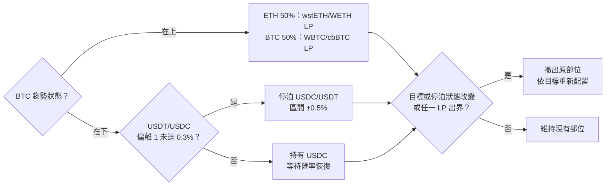

# BTC／ETH 三池連動策略研究報告

日期：2026-09-30（2026-10-01 更新：新增第 7–9 節：策略改進、起始月份敏感度、ETH 單獨下跌的防護；2026-10-02 更新：新增第 10 節：報酬拆解；第 11 節：純現貨版本與 2026 樣本外；第 12 節：穩健性檢查）
分支：`joy/my-strategy`（從 `remix` 分出，含 `defense_v6`）
回測框架：Demeter（Uniswap v3 LP 回測）

---

## 摘要

- **v6 回測可在本機重現**：用外部提供的歷史資料跑 `gamma_ig_gap_bands_defense_v6.py`，2025 年結果與分支文件一致（+16.55% 對比文件 +16.6%）。
- **BTC 在鏈上分鐘資料中沒有可交易的領先性**：分鐘、小時級都沒有，波動外溢也沒有額外資訊。唯一的線索是日線的 BTC 趨勢，但統計上不顯著。
- **BTC–穩定幣池的歷史資料品質不足**：2022–2024 年幾乎沒有交易量。所以改用「方案 A」：BTC 價格由 ETH/USDC × WBTC/WETH 換算，只在這兩個流動性好的池子做 LP。
- **三池濾網策略的結論**：
  - ✅ **加趨勢濾網、區間 ±20% 以上**在所有參數組合下都成立，大幅降低回撤。
  - ✅ **依 ETH/BTC 趨勢調整兩池比例（tilt_follow）**是最穩定的元件：樣本外 40/52 次贏過固定比例。但這四年 ETH/BTC 都在走弱，還沒在反向行情中驗證過。
  - ⚠️ **「BTC 濾網優於 ETH 濾網」只靠 2022 年一次事件支持**，其他年份兩者差不多。
  - ⚠️ **本質是熊市保險**：整段 2022–2025 贏過持有，但在 2023–2025 多頭期間遠遠輸給單純持有 BTC 或 ETH。
- **策略改進（第 7 節）**：
  - ✅ **小幅遲滯（1%）**：重建次數從 106 降到 74，成本少約 $4k，最大回撤從 −35% 改善到 −31%。
  - ✅ **濾網關閉時停泊到 USDC/USDT**：扣掉脫鉤期間的模擬假象後，4 年約多 7 pt。
  - ❌ **每小時檢查出界反而變差**：報酬少 24 pt，回撤擴大到 −39%。
  - 目前最好的組合是「停泊 + 遲滯 1% + 每日檢查」：+154%、回撤 −31%（基準為 +143%、−35%）。但這組是事後挑選的，差距也還不足以證明。
- **起始月份敏感度（第 8 節）**：37 個起點的年化全部為正（+10% 到 +44%），「停泊 + 遲滯 1%」在每個起點都贏過基準；跟持有 50/50 比大約各贏一半。
- **報酬拆解（第 10 節）**：
  - ❌ **做 LP 是扣分項**：用相同規則改持有現貨，7 個設定全部比 LP 好，4 年多 14 到 68 pt。手續費不夠抵銷無常損失和重建成本。
  - ✅ **報酬主要來自 BTC 濾網**：在相同曝險下，從 +28% 提高到 +136%，回撤從 −59% 降到 −32%。
  - ⚠️ **tilt 多出的約 42 pt 裡，約 33 pt 只是多持有 BTC**。時機檢定贏過 96% 的隨機平移，但期間內 ETH/BTC 只有一段單向趨勢，無法分辨。
- **純現貨版本（第 11 節）**：
  - ✅ **2026 年樣本外（1–9 月）濾網的保護成立**：持有 BTC 和 ETH 的回撤是 −40% 到 −55%，4 個事先指定的候選壓在 −11% 到 −15%，報酬 −2% 到 +9%，都比持有好。
  - ❌ **曝險固定時 tilt 沒有用**；walk-forward 挑參數也沒有穩定的好處。
  - 回測中最均衡的組合：BTC 收盤高於 EMA100 時持有 ETH 50%、BTC 50%，否則全部換成 USDC。
- **穩健性檢查（第 12 節）**：
  - ✅ **回撤保護很穩健**：24 個換日時間、EMA 90–160 都成立；bootstrap 中有 97% 的機率回撤比持有小。
  - ⚠️ **報酬數字的雜訊很大**：只換日線的切分時間，4 年報酬就從 +165% 到 +310%。報酬優勢在 bootstrap 中約有 85% 的機率成立。
  - ⚠️ **這是標準的趨勢濾網**：SMA200 類的規則效果接近，這組沒有明顯更好。
  - 執行延遲 12 小時以內沒有影響；閒置 USDC 的收益每年約多 1–3 pt；30 日波動度上限 40% 可以把回撤從 −36% 降到約 −27%。
- **主要風險（第 9 節）**：ETH 單獨下跌時（2024-12 到 2025-03），BTC 濾網保護不到，回撤約 −31%。用 ETH 自己的 EMA 來防護試了三種做法，都沒用，而且在其他年份代價很大，所以不採用。

---

## 1. 資料與環境

### 1.1 資料來源

歷史資料來自外部提供的壓縮檔（`sample拷貝.zip`，約 700 MB），內容是 11 個 Uniswap v3 池子的分鐘級 CSV，格式與 [demeter-fetch](https://github.com/zelos-alpha/demeter-fetch) 產出的相同。解壓到 `samples/real-data/<pool address>/`，這個路徑已被 `.gitignore` 排除。

本研究用到的三個池子：

| 池子 | 交易對 | 手續費 | 資料期間 | 用途 |
|---|---|---|---|---|
| `0x88e6a0c2…f5640` | USDC / WETH | 0.05% | 2021-05-05 ~ 2026-01-04 | ETH 價格、LP 第一條腿 |
| `0x4585FE77…5a20c0` | WBTC / WETH | 0.05% | 2021-05-06 ~ 2026-01-17（缺 2021-05-12） | ETH/BTC 匯率、LP 第二條腿 |
| `0x56534741…9A83b2` | WBTC / USDT | 0.05% | 2021-06-11 ~ 2026-02-20（2024–25 缺 8 天） | 只用於領先落後分析 |
| `0x3416cF6C…3527C6` | USDC / USDT | 0.01% | 2021-11-15 ~ 2025-12-31（無缺日） | 第 7 節：濾網關閉時的停泊池 |

zip 內其餘池子：DAI/USDT、wstETH/ETH、WBTC/cbBTC、WBTC/WETH 0.3%，以及三個 Arbitrum 池。

### 1.2 資料品質

| 年份 | ETH/USDC 日交易量中位數 | BTC/USDT 日交易量中位數 | WBTC/WETH 日交易量中位數 | 有交易的分鐘比例（ETH／BTC／比率） |
|---|---|---|---|---|
| 2022 | $546M | ≈ $0 | $70M | 96% / 0% / 37% |
| 2023 | $226M | ≈ $0.01M | $27M | 93% / 1% / 32% |
| 2024 | $209M | ≈ $0 | $51M | 96% / 8% / 44% |
| 2025 | $104M | $15.9M | $20M | 93% / 46% / 59% |

**BTC/USDT 池在 2025 年之前幾乎是死池**，2024–2025 年最長有約 2.5 天沒有任何交易。這決定了後續採用方案 A。

---

## 2. 嘗試一：重現 v6 回測

在 `remix` 分支上，用預設設定跑 `gamma_ig_gap_bands_defense_v6.py`（2025 全年、100,000 USDC、每日判定），約 7 分鐘完成。

| 項目 | 分支文件（2026-09-29） | 本機重跑 |
|---|---|---|
| 報酬率 | +16.6% | +16.55% |
| 本金（LP 淨值） | $95.1k | $95,079 |
| 手續費收入 | $20.8k | $20,781 |
| swap 成本 | $556 | $556.43 |
| ETH 持有報酬（池價） | −11% | −10.9% |

**結論**：資料和環境都正確，可以作為後續研究的基準。

---

## 3. 嘗試二：BTC 是否領先 ETH？

程式：[`samples/research/btc_lead_eth.py`](../samples/research/btc_lead_eth.py)
資料：2024–2025 年，三個池子的分鐘價格

### 3.1 領先落後相關性（lag 為 1 根 K 棒）

| K 棒 | 同期相關 | BTC→ETH | ETH→BTC |
|---|---|---|---|
| 1 分 | 0.300 | 0.038 | **0.107** |
| 15 分 | 0.491 | 0.018 | **0.082** |
| 60 分 | 0.556 | 0.000 | **0.089** |
| 1 日 | 0.776 | −0.027 | −0.039 |

**反而是 ETH 領先 BTC 池**。這是因為 BTC 池交易稀少、價格更新慢，屬於套利時間差造成的假象，不是市場真的誰先動。

### 3.2 事件研究：BTC 在 15 分鐘內大漲或大跌之後

| BTC 變動 | 事件數 | ETH 之後 15 分 | 60 分 | 240 分 | 跟隨機率 |
|---|---|---|---|---|---|
| > 1% | 944 | +3.6 bps | +0.3 bps | +7.9 bps | 46–50% |
| > 1%，且 ETH 當下沒跟 | 407 | +1.4 bps | −0.6 bps | +4.6 bps | 46–50% |

**ETH 不會補漲或補跌**，幅度遠小於 0.05% 的交易成本。

### 3.3 波動外溢

- 預測 ETH 下一小時的波動時，加入 BTC 波動，R² 只從 0.503 升到 0.505。
- 未來 4 小時 ETH 漲跌超過 3% 的機率：
  - 平常：6.6%
  - BTC 波動暴增：10.3%
  - BTC 暴增但 ETH 平靜：6.4%，跟平常一樣
  - ETH 自己波動暴增：12.0%

**BTC 的警訊在 ETH 自己的波動裡已經看得到。**

### 3.4 日線趨勢（唯一的線索）

| 前一日收盤的狀態 | 天數 | ETH 隔日平均報酬 |
|---|---|---|
| BTC 在 EMA100 之上 | 516 | +0.13% |
| BTC 在 EMA100 之下 | 215 | −0.19% |
| ETH 在 EMA100 之上 | 414 | +0.11% |
| ETH 在 EMA100 之下 | 317 | −0.07% |

用 BTC 趨勢區分好壞日子比用 ETH 自己的趨勢略清楚，但 t 值約 1，**不顯著**。

---

## 4. 策略設計：方案 A

因為 BTC–穩定幣池的資料不足，改採：

- **BTC/USD 價格** = ETH/USDC × WETH/WBTC，從 2021-05 起有連續資料。
- **只在兩個流動性好的池子做 LP**：ETH/USDC 0.05% 和 WBTC/WETH 0.05%。

策略程式：[`samples/strategy-example/tri_btc_eth_gate.py`](../samples/strategy-example/tri_btc_eth_gate.py)

### 4.1 規則（每日 UTC 00:00，依前一日收盤判定）

1. **濾網（gate）**：決定資金放進池子，還是全數換回 USDC。
   - `none`：永遠在場
   - `btc`：換算出的 BTC 收盤價 > EMA
   - `eth`：ETH 收盤價 > EMA
   - `both`：上面兩個條件都成立
2. **兩池比例**：
   - 固定：各一半
   - `follow`：ETH/BTC 在 EMA 之上（ETH 相對強）時，兩池比例為 75/25（ETH/USDC／WBTC/WETH），否則為 25/75
   - `fade`：與 follow 相反
3. **區間**：預設 ETH/USDC 為現價 ±20%，WBTC/WETH 為 ±10%。
4. **重建時機**：目標狀態改變，或價格超出任一條腿的區間時。
5. **選用的改進（第 7 節）**：
   - 停泊：濾網關閉時，把 USDC 放進 USDC/USDT ±0.5%
   - 遲滯：訊號要超過 EMA ±b 才切換
   - 每小時檢查出界

### 4.2 完整流程圖

以 `btc100_follow` 為主線。其他組合只在「濾網」和「比例」兩個判斷不同：濾網可換成 ETH、兩者都要成立或不過濾；比例可改成固定 50/50（跳過 ETH/BTC 判斷）或 fade（75/25 與 25/75 對調）。


流程中容易忽略的細節：

1. **每個池子同時只有一個部位**：區間內流動性均勻分布，不是 v6 那種 8+8 共 16 段的階梯。
2. **出界一天只檢查一次**：白天價格跑出區間，要等隔天 00:00 才會重建。這段時間部位全部是單一幣種，也分不到手續費。
3. **比例一變，兩池就全部重建**：follow 和 fade 每切換一次，都是一次完整重建的成本。tilt 版本重建了 106 次，固定 50/50 是 78 次。
4. **目標是 USDC、而且本來就在 USDC 時不會動作**，不產生任何成本。
5. **手續費會複利**：撤部位時手續費跟本金一起領回，下次重建全部放回池子。v6 則是領到手續費就賣成 USDC，不再投入。
6. **區間邊界會對齊 tick**：±20% 和 ±10% 是以重建當下的價格計算，再對齊池子的 tick 間距，所以實際寬度會有些微誤差。

### 4.3 成本與模擬設定

- **swap**：付池子手續費 0.05%，不計滑價。
- **gas**：事後從 Demeter 的動作紀錄估算，算法是「各動作 gas 用量 × 當年平均 gas 價格 × ETH 價格」。

| 動作 | gas 用量（假設） |
|---|---|
| 新增流動性 | 450k |
| 移除流動性 | 150k |
| 領取手續費 | 120k |
| swap | 130k |

| 年份 | 2021 | 2022 | 2023 | 2024 | 2025 |
|---|---|---|---|---|---|
| gas 價格（假設，gwei） | 50 | 40 | 30 | 15 | 3 |

  這些都是粗估，不是實測值。
- **手續費分母修正（第 7 節起）**：Demeter 計算手續費占比時，用的是「我的流動性 ÷ 池子鏈上流動性」，分母沒有算進自己的部位。在池子很深時影響很小，但在流動性稀薄的價位（例如 2023/3 USDC 脫鉤時的 USDC/USDT 池）會大幅高估手續費。所以策略程式在載入時把它改成「我的流動性 ÷（池子流動性 + 我的流動性）」。這個修改只影響這支程式，不動 Demeter 核心，也不影響 v6。修正後，基準 btc100_follow 從 +144.4% 變為 +143.2%，固定 50/50 從 +83.7% 變為 +82.8%。第 5、6 節的數字是修正前跑的，大約高估 1 pt。
- **模擬粒度**：以小時 K 棒回測，分鐘資料用 Demeter 內建規則重新取樣。訊號使用分鐘級的日收盤價。
- **期間**：2021-05-13 到 2021-12-31 只用來暖身 EMA，實際交易期間為 2022-01-01 ~ 2025-12-31。

---

## 5. 嘗試三：參數穩健性、區間、tilt、gas

結果檔：`samples/strategy-example/result/tri-gate/summary.csv`（17 組）。

以下都是**扣除估算 gas 後**的結果，初始資金 100,000 USDC。

### 5.1 EMA 週期 × 濾網（兩池各半）

| EMA | BTC 濾網 | ETH 濾網 | 兩者都要成立 |
|---|---|---|---|
| 50 | +56.3% | +19.5% | +42.1% |
| 100 | +83.7% | +22.5% | +60.2% |
| 150 | +102.0% | +69.0% | +106.8% |
| 200 | +42.8% | +68.7% | +61.6% |
| 不過濾 | −8.0%（回撤 −66.5%） | | |
| *持有 50% BTC、50% ETH* | *+34.9%（回撤 −69.7%）* | | |

- 12 組有濾網的全部賺錢，最大回撤介於 −20% 和 −41% 之間。
- 4 個週期裡 3 個是 BTC 濾網勝，EMA200 是 ETH 濾網勝。
- 同樣是 BTC 濾網，報酬從 +43% 到 +102% 都有，**對週期很敏感**。

### 5.2 區間寬度（BTC 濾網、EMA100）

| 區間（ETH/USDC ／ WBTC/WETH） | 4 年合計 | 重建次數 | swap 加 gas 成本 |
|---|---|---|---|
| ±10% ／ ±5% | +33.7% | 139 | $16.0k |
| ±20% ／ ±10% | +83.7% | 78 | $9.2k |
| ±30% ／ ±15% | +83.6% | 67 | $7.7k |

### 5.3 依 ETH/BTC 趨勢調整比例（BTC 濾網、EMA100）

| 做法 | 2022 | 2023 | 2024 | 2025 | 合計 | 最大回撤 |
|---|---|---|---|---|---|---|
| tilt_follow | +0.6% | +44.1% | +50.1% | +16.2% | **+144.4%** | −35.0% |
| 固定各半 | −1.3% | +39.2% | +35.3% | +1.5% | +83.7% | −30.5% |
| tilt_fade | −5.3% | +33.0% | +30.6% | −1.6% | +58.4% | −27.8% |

### 5.4 對照：持有

| | 2022 | 2023 | 2024 | 2025 | 合計 | 最大回撤 |
|---|---|---|---|---|---|---|
| 持有 BTC | −64.2% | +163.8% | +123.8% | −6.2% | +88.9% | −67.6% |
| 持有 ETH | −67.3% | +95.3% | +47.1% | −10.8% | −19.2% | −76.8% |
| 持有 50% BTC、50% ETH | −65.8% | +131.1% | +92.8% | −7.7% | +34.9% | −69.7% |

### 5.5 gas

四年合計 $2.9k–8.1k，大部分發生在 2022–2023 年。2025 年的 gas 價格假設只有 3 gwei，影響幾乎可以忽略。

### 5.6 分鐘級驗證（2025 年，從 1/1 重新開始）

結果檔：`minute_check_2025-01-01.csv`

| 策略 | 小時級 | 分鐘級 |
|---|---|---|
| mix_btc100 報酬／最大回撤 | +0.1% ／ −27.0% | −0.8% ／ −35.2% |
| mix_none 報酬／最大回撤 | −6.1% ／ −42.4% | −7.6% ／ −44.0% |

- 兩種粒度的重建次數與成本完全相同，交易決策一致。
- 小時級每年大約**高估報酬 1–1.5 pt**。
- 小時級**明顯低估最大回撤**：分鐘級的瞬間暴跌會被小時 K 棒抹平。

---

## 6. 嘗試四：Walk-forward 驗證

程式：[`samples/research/walk_forward.py`](../samples/research/walk_forward.py)
候選：39 組，由 {none, btc, eth, both} 濾網 × {50, 100, 150, 200} EMA 週期 × {固定, follow, fade} 組成。不過濾時不需要週期，只有 3 組。區間固定為 ±20%／±10%。
結果檔：`nav_grid.csv`、`walk_forward_picks.csv`、`walk_forward_summary.csv`

採用擴張視窗：用 2022 年選參數測 2023 年，用 2022–23 年選參數測 2024 年，用 2022–24 年選參數測 2025 年。

### 6.1 每年選到的組合（依訓練期報酬挑選）

| 測試年 | 選到 | 測試年報酬 | 在 39 組中的排名 | 中位數 | 當年最佳 |
|---|---|---|---|---|---|
| 2023 | btc150_follow | +35.1% | 24／39 | +37.4% | +93.2%（不過濾） |
| 2024 | btc100_follow | +50.1% | 1／39 | +28.5% | +50.1% |
| 2025 | btc100_follow | +16.2% | 8／39 | +9.5% | +23.5% |

### 6.2 樣本外合計（2023–2025）

| 策略 | 2023–25 | 最大回撤 |
|---|---|---|
| walk-forward（依報酬挑選） | +135.6% | −34.4% |
| walk-forward（依 Calmar 挑選） | +99.1% | −33.1% |
| 隨便挑一組（中位數） | +93.3% | — |
| 事後最佳 | +258.1% | — |
| 持有 50% BTC、50% ETH | +295.6% | −41.6% |
| 持有 BTC | +429.6% | −35.3% |

### 6.3 各元件在樣本外是否一致

**tilt 贏過固定比例的次數**（13 組濾網 × 週期組合）：

| | 2022 | 2023 | 2024 | 2025 | 合計 |
|---|---|---|---|---|---|
| follow | 13/13 | 6/13 | 10/13 | 11/13 | 40/52 |
| fade | 1/13 | 0/13 | 3/13 | 0/13 | 4/52 |

**各濾網的年度報酬中位數**：

| | 2022 | 2023 | 2024 | 2025 |
|---|---|---|---|---|
| BTC | −3.1% | +36.3% | +30.1% | +11.8% |
| ETH | −22.3% | +39.0% | +25.9% | +11.9% |
| 兩者都要成立 | −4.5% | +35.1% | +26.2% | +3.1% |
| 不過濾 | −62.5% | +85.1% | +38.3% | −5.2% |

---

## 7. 嘗試五：策略改進（停泊、遲滯、每小時檢查）

程式：`tri_btc_eth_gate.py --improve`
結果檔：`summary_improve.csv`、`nav_improve.csv`

以 walk-forward 選出的 `btc100_follow` 為基準，三項改進先分別測試，再組合起來測。

### 7.1 三項改進

1. **停泊**：濾網關閉時，把 USDC 放進 USDC/USDT 0.01% 池（`0x3416…`），區間 ±0.5%。另外加上保護：USDT/USDC 偏離 1 達 0.3% 以上時不停泊，資金留在 USDC，等價格回到正常再放回去。
2. **遲滯區間**：訊號要漲破 EMA × (1 + b) 才轉為「在上」，跌破 EMA × (1 − b) 才轉為「在下」，中間維持原本狀態。濾網和 tilt 都套用。測試 b = 1%、2%、5%。
3. **每小時檢查出界**：切換的判定仍只在 00:00 做，但每小時檢查一次是否出界，出界就重新置中。

### 7.2 結果（2022–2025，已扣估算 gas）

| 組合 | 4 年合計 | 扣掉 2023/3 假象 | 最大回撤 | 重建次數 | swap + gas 成本 |
|---|---|---|---|---|---|
| 基準 follow_base | +143.2% | — | −35.0% | 106 | $14.0k |
| 停泊 | +157.0% | +150.2% | −35.1% | 110 | $16.0k |
| 遲滯 1% | +146.1% | — | −31.2% | 74 | $10.0k |
| 遲滯 2% | +128.5% | — | −31.8% | 66 | $8.7k |
| 遲滯 5% | +136.9% | — | −32.0% | 52 | $6.5k |
| 每小時檢查 | +119.5% | — | −39.3% | 116 | $14.7k |
| 停泊 + 遲滯 2% | +142.3% | — | −31.6% | 70 | $10.0k |
| 三項全開（遲滯 2%） | +122.3% | +114.3% | −34.2% | 94 | $11.4k |
| **停泊 + 遲滯 1%（每日檢查）**＊ | **+160.8%** | **+154.1%** | **−31.2%** | 78 | $11.5k |
| 固定 50/50 基準 | +82.8% | — | −30.5% | 78 | $9.2k |
| 固定 50/50 三項全開 | +84.7% | +81.3% | −31.9% | 86 | $9.0k |

＊看過其他結果後才補跑的組合，屬於事後挑選。

「扣掉 2023/3 假象」的算法：把 2023 年 3 月的逐小時報酬，換成同設定但沒有停泊的版本，見 7.4。

逐年報酬：

| 組合 | 2022 | 2023 | 2024 | 2025 |
|---|---|---|---|---|
| 基準 | +0.6% | +44.1% | +49.9% | +15.8% |
| 停泊 | +2.0% | +49.4% | +50.6% | +15.8% |
| 遲滯 1% | +2.8% | +39.3% | +47.7% | +20.4% |
| 遲滯 5% | −8.5% | +48.5% | +34.5% | +33.9% |
| 每小時檢查 | +0.6% | +47.9% | +37.0% | +11.3% |
| 停泊 + 遲滯 1% | +4.7% | +44.2% | +48.3% | +20.5% |

### 7.3 解讀

1. **停泊有幫助，但幅度小**：扣掉脫鉤假象後，4 年大約多 7 pt，平均每年約 1.5 pt。主要來自濾網關閉天數最多的 2022 年。
2. **遲滯可靠的好處是降低成本和回撤**：重建次數少 30–50%，回撤改善約 3–4 pt。但總報酬沒有一致的方向，1% 最好、2% 最差、5% 又回升。逐年來看差異很大，代表遲滯主要是改變了切換的日期，報酬差異很大程度是運氣。所以建議用小的遲滯（1%）。
3. **每小時檢查出界反而變差**：價格一出界就在極端價位重建，價格回頭時等於把無常損失鎖死，還多付了重建成本。每日檢查一次，反而給了價格回到區間的時間。「出界要盡快處理」這個直覺在這裡不成立。
4. **目前最好的組合是停泊 + 遲滯 1% + 每日檢查**：扣掉假象後 +154%、回撤 −31%，基準是 +143%、−35%。但這組是事後挑選的，約 10 pt 的差距在四年資料上還不足以證明。

### 7.4 USDC 脫鉤（2023/3）的模擬問題

停泊版本在 2023 年 3 月出現不合理的超額報酬。追查後發現兩個原因：

1. **分母沒有算自己的流動性**：見 4.3 的「手續費分母修正」。修正後，第一季的超額報酬從 +5.8 pt 降到 +4.2 pt。
2. **成交量歸屬的假象**：3/11 價格從 1.008 一路衝到 1.10，穿過我窄窄的 ±0.5% 區間，而當天的成交量是數十億美元。Demeter 會依「價格路徑在我區間內的比例」，把整根 K 棒的成交量算給我。但實際上，價格穿越一次最多只能換掉我手上約 $52k 的 USDT，只會產生幾美元的手續費，模型卻記了約 $3,800。

| 2023 年 3 月，停泊減掉不停泊 | 小時級 | 分鐘級 |
|---|---|---|
| 超額報酬 | +3.9 pt | +1.1 pt |

就算用分鐘級，模型也還是假設成交量全部經過我的區間，所以實際的好處應該更小。

因此加上了「偏離 0.3% 就不停泊」的保護（`PARK_MAX_DEPEG`）。但脫鉤剛開始的那幾個小時仍會落在這個假象裡，所以 7.2 另外列出「扣掉 2023/3 假象」的數字作為參考。

---

## 8. 嘗試六：起始月份敏感度

程式：`tri_btc_eth_gate.py --starts`
結果檔：`starts_summary.csv`
互動頁面：起始月份圖表與每月報酬熱圖已發布為 artifact（私人連結，需要從頁面的 Share 選單開放權限才能分享）。

做法：從 2022-01 到 2025-01，每個月 1 日各起跑一次，共 37 個起點，全部跑到 2025-12-31。每個起點都從 100,000 USDC 開始，並扣除估算 gas。持有組合從同一天買入，持有到期末。

### 8.1 37 個起點的年化報酬

| 策略 | 年化中位數 | 最差起點 | 最好起點 | 年化為正 | 贏過持有 50/50 | 最大回撤中位數 |
|---|---|---|---|---|---|---|
| 停泊 + 遲滯 1% | +31.5% | +10.2%（2024-04） | +43.6%（2023-10） | 37 / 37 | 21 / 37 | −31.2% |
| 基準 btc100_follow | +29.2% | +7.9%（2024-12） | +41.9%（2023-10） | 37 / 37 | 19 / 37 | −34.9% |
| 固定 50/50 | +17.5% | −2.9%（2024-12） | +25.9%（2023-11） | 34 / 37 | 7 / 37 | −30.4% |
| 持有 50% BTC + 50% ETH | +31.1% | −13.5%（2024-12） | +57.3%（2023-01） | 35 / 37 | — | −44.5%（最差 −69.7%） |
| 持有 BTC | +45.7% | −8.5%（2024-12） | +74.4%（2023-01） | 35 / 37 | 37 / 37 | −35.3%（最差 −67.6%） |

### 8.2 解讀

1. **策略的結果不太受起點影響**：停泊 + 遲滯 1% 在每個起點都賺錢，年化介於 +10% 到 +44%。持有 50/50 則從 −13.5% 到 +57.3% 都有。
2. **改進版在 37 個起點全部贏過基準**，年化多 1–4 pt。2023-04 之後起跑的 22 個起點完全避開了 USDC 脫鉤，也全部勝出，所以第 7 節的改進不是靠特定起點，也不是靠脫鉤期間的假象。
3. **跟持有 50/50 比大約各贏一半**：
   - 策略勝：2022-01 到 2022-06 起跑（熊市中進場），以及 2023-11 之後起跑
   - 持有勝：2022-07 到 2023-10 起跑（在低點附近進場，接著碰上多頭）

   兩者的中位數幾乎一樣，但策略的最差情況好很多。
4. **幾乎每個起點的最大回撤都是約 −31%，而且來自同一段下跌**：2024-12-16 到 2025 年 2–3 月。這段期間 ETH 從約 $4,000 跌到約 $2,100，但 BTC 一直在 EMA 之上，所以 BTC 濾網沒有關閉。這是 BTC 濾網的盲點：只有 ETH 大跌時保護不了。第 9 節針對這點做了測試。
5. **固定 50/50 明顯較弱**：只有 7 / 37 個起點贏過持有 50/50。用 ETH/BTC 調整比例（follow），在所有起點都有幫助。

---

## 9. 嘗試七：ETH 單獨下跌的防護

程式：`tri_btc_eth_gate.py --ethguard`
結果檔：`summary_ethguard.csv`、`nav_ethguard.csv`

針對第 8 節發現的盲點，在「停泊 + 遲滯 1%」上測試三種防護方式。這三種都是看到那段下跌之後才設計的，所以重點是看它們在其他年份要付出多少代價。

| 方式 | 規則 |
|---|---|
| both | BTC 和 ETH 都要在 EMA 之上才進場，任何一個跌破就全部出場 |
| half | 維持 BTC 濾網，但 ETH 跌破自己的 EMA 時只投入一半，另一半停泊到穩定幣池（`eth_weak_scale=0.5`） |
| eth | 只看 ETH 自己的濾網，作為對照 |

### 9.1 結果（2022–2025，已扣估算 gas）

| 方式 | 2022 | 2023 | 2024 | 2025 | 4 年合計 | 最大回撤 | 2024-12-16 ~ 2025-03-04 |
|---|---|---|---|---|---|---|---|
| **停泊 + 遲滯 1%（不加防護）** | +4.7% | +44.2% | +48.3% | +20.5% | **+160.8%** | −31.2% | −22.7% |
| both | +4.7% | +36.0% | +21.1% | +4.2% | +73.7% | −32.0% | −22.3% |
| half | +4.7% | +39.0% | +26.9% | +12.2% | +100.1% | −31.7% | −22.7% |
| eth | −23.5% | +48.7% | +17.9% | +8.1% | +40.1% | −34.2% | −22.6% |

### 9.2 解讀

1. **三種防護都沒有擋住這段下跌**，期間損失都在 −22% 到 −23%，和沒有防護時差不多。原因是 ETH 自己的 EMA 訊號在 EMA 附近反覆切換：
   - ETH 直到 2025-01-10 才跌破 EMA，那時已經是高點後將近一個月。
   - 之後到 2/2 為止又來回切換了 6 次，最後一次重新進場，正好碰上 2/3 的暴跌。
   - 2024 全年，ETH 訊號切換了 14 次。每次切換都要付一次完整重建的成本，還常常碰上短線反轉。
2. **其他年份付出很大的代價**：2024 年從 +48% 降到 +18%～+27%，4 年合計從 +161% 降到 +40%～+100%。最大回撤也沒有改善。both 和 eth 的回撤甚至變成 2024-03 到 2025-05 的長期下滑。
3. **結論：三種防護都不採用。**「ETH 單獨下跌時約 −31% 的回撤」是這個策略已知的風險。
4. **一條線索，但不建議追**：ETH/BTC 的 tilt 訊號在 2024-12-10、高點前一週，就已經判斷 ETH 轉弱，策略也已經轉為 25/75。但 WBTC/WETH 池本身仍約有一半是 ETH，所以保護有限。若改成「ETH/BTC 弱時只投入一半」，因為 2022–2025 年 ETH/BTC 大多數時間都偏弱，等於多數時間都會降低曝險，而且這個點子也是看了這段下跌才想出來的。在用 2017–2021 年資料驗證之前，不建議採用。

---

## 10. 嘗試八：報酬拆解（LP 到底有沒有貢獻）

程式：`tri_btc_eth_gate.py --decompose`
結果檔：`summary_decompose.csv`、`nav_decompose.csv`、`tilt_shuffle.csv`

### 10.1 做法

每個設定都跑兩個版本：

- **LP**：原本的策略。
- **現貨**：判斷規則、重建時間點都和 LP 相同，但不放流動性。每次重建時，直接用現貨持有「LP 剛放下去那一刻的幣種組成」：ETH/USDC ±20% 約 45% ETH，WBTC/WETH ±10% 約 48% WBTC，依區間公式計算。swap 按池子路徑各付 0.05%，也扣 gas。不停泊。

兩個版本的差額，就是「手續費 − 無常損失 − LP 多出來的成本」。手續費的算法是 collect 的金額減掉同一部位 remove 的本金，再加上期末還沒領的部分。

注意：兩池的曝險在中央時是 ETH 約 50%，BTC 在 75/25 時約 12%、25/75 時約 36%。也就是說，**tilt 不會改變 ETH 曝險，只會改變「BTC 還是 USDC」**。

### 10.2 結果（2022–2025，已扣估算 gas）

| 設定 | 現貨 4 年 | LP 4 年 | LP − 現貨 | 現貨最大回撤 | LP 最大回撤 | 手續費收入 |
|---|---|---|---|---|---|---|
| 不過濾，固定 50/50 | +27.7% | −8.4% | −36 pt | −59.1% | −66.5% | $131k |
| BTC 濾網，固定 50/50 | +136.2% | +82.8% | −53 pt | −31.5% | −30.5% | $131k |
| BTC 濾網，follow | **+178.6%** | +143.2% | −35 pt | −34.4% | −35.0% | $149k |
| BTC 濾網，fade | +92.5% | +57.4% | −35 pt | −28.5% | −27.8% | $126k |
| BTC 濾網，永遠 25/75 | +168.8% | +100.9% | −68 pt | −34.4% | −34.6% | $131k |
| BTC 濾網，永遠 75/25 | +105.4% | +63.1% | −42 pt | −28.5% | −26.2% | $129k |
| BTC 濾網，follow + 遲滯 1% | +159.7% | +146.1% | −14 pt | −30.8% | −31.2% | $148k |

LP − 現貨的逐年差異（pt）：

| 設定 | 2022 | 2023 | 2024 | 2025 |
|---|---|---|---|---|
| 固定 50/50 | +0.2 | −3.4 | −12.2 | −16.0 |
| follow | −0.7 | −3.7 | −5.8 | −7.5 |
| follow + 遲滯 1% | 0.0 | −2.2 | −4.1 | −0.9 |

### 10.3 tilt 是時機還是 BTC 曝險？

- 固定 50/50 → 永遠 25/75：+136% → +169%。多出的 33 pt，只是因為多持有 BTC。
- 永遠 25/75 → follow：+169% → +179%。時機只多了約 10 pt，而且 follow 平均 BTC 曝險（16.5%）比永遠 25/75（20.2%）還低。
- **時機檢定**：把 ETH/BTC 訊號隨機平移 60 天以上，共 200 次。這樣保留了「弱勢天數的比例」和「訊號的持續性」，但打亂了時機。結果中位數 +139.5%（5%–95% 區間 +101.5% 到 +174.9%），真實訊號 +178.6% 贏過其中 96%。

### 10.4 解讀

1. **LP 這一層在 7 個設定裡全部是負的**：4 年少了 14 到 68 pt。手續費大約 $130–150k，但無常損失加上重建成本更多。上漲年份最明顯，每年約 −4 到 −16 pt。2022 年濾網大多關閉，所以差異接近 0。
2. **這個方向應該是可靠的**：小時級模擬會高估 LP 報酬（5.6 節），手續費分配也偏樂觀（7.4 節），兩者都會讓 LP 看起來更好。修正之後，LP 只會更差。
3. **報酬主要來自濾網**：在相同曝險下，加 BTC 濾網從 +28% 變成 +136%，回撤從 −59% 降到 −32%。
4. **tilt 有一部分是時機，但無法和「ETH/BTC 這四年一路走弱」分開**：時機檢定 p ≈ 0.04，但期間內只有一段單向趨勢，「動能訊號抓到趨勢」和「剛好一直超配 BTC」在這份資料裡看起來一樣。
5. **遲滯 1% 在 LP 版有用、在現貨版反而變差**：LP 版從 +143% 到 +146%，現貨版從 +179% 降到 +160%。遲滯主要省的是 LP 的重建成本和無常損失被鎖死的次數，對現貨沒有這個好處。
6. **限制**：現貨版也會在 LP 出界時重新平衡，這是為了和 LP 同步才這樣做。真正的現貨策略只需要在目標改變時交易，結果可能略有不同。手續費以收取當下的美元計價，所以「無常損失＋成本」這一欄是推算的差額，不是獨立量測的。

---

## 11. 嘗試九：純現貨版本（含 2026 年樣本外）

程式：[`samples/strategy-example/spot_btc_eth_gate.py`](../samples/strategy-example/spot_btc_eth_gate.py)
執行環境：backtest 機器（`aws-backtest-ssm`）的 `~/demeter-joy`，資料從 demeter S3 bucket 同步。
結果檔：`result/spot-gate/` 下的 `grid_c10.csv`、`starts_c10.csv`、`walk_forward_c10.csv`、`holdout_c10.csv`（`c5` 為 5 bps 版本）。

### 11.1 做法

- **規則**：與三池版相同，每日 00:00 依前一日收盤判定。濾網開啟時持有指定比例的 ETH 和 BTC 現貨，其餘放 USDC；**只在目標比例改變時交易**，中間讓部位隨價格漂移。
- **成本**：每筆交易依成交金額付 10 bps（另跑一組 5 bps），不計 gas，假設在 CEX 或 L2 執行。
- **網格**：濾網 {none, btc, eth, both} × EMA {50, 100, 150, 200} × 遲滯 {0, 1%, 2%, 5%} × 比例 6 種，共 294 組：
  - `lp_tilt`／`lp_fixed`：與 LP 版相同的曝險，加密資產占 60–86%
  - `full_fixed`：ETH 50%、BTC 50%
  - `full_tilt`：依 ETH/BTC 強弱在 75/25 與 25/75 之間切換
  - `btc_only`：全部持有 BTC
  - `switch`：ETH 相對強時全部持有 ETH，否則全部持有 BTC
- **樣本外**：S3 的資料已更新到 2026-09-30。**2026 年的資料完全不參與挑選**，只在最後看一次。看的對象是第一次執行前就寫死在程式裡的 4 個候選（都是 BTC 濾網、EMA100、不加遲滯），以及用 2022–2025 年選出來的 walk-forward 組合。

### 11.2 樣本內（2022–2025，10 bps）

| 組合 | 4 年合計 | 最大回撤 | 交易次數 |
|---|---|---|---|
| btc100 `lp_tilt` | +190.8% | −33.7% | 100 |
| btc100 `full_tilt` | +196.1% | −33.9% | 100 |
| btc100 `full_fixed` | +217.1% | −35.8% | 61 |
| btc100 `btc_only` | +203.3% | −32.6% | 61 |
| 持有 50% BTC、50% ETH | +34.9% | −69.7% | — |
| 持有 BTC | +88.9% | −67.6% | — |

各濾網的中位數：BTC 濾網 +123%、兩者都要成立 +66%、ETH 濾網 +44%、不過濾 +33%（回撤 −69%）。

起始月份（2022-01 到 2025-01，共 37 個起點）的年化報酬：`full_fixed` 中位數 +41%，最差 +13%；`lp_tilt` 中位數 +38%，最差 +18%；`btc_only` 最差 −3%；持有 50/50 中位數 +31%，最差 −13.5%。

改成 5 bps 時，4 年大約多 7 pt，排序不變。

### 11.3 tilt 在現貨版沒有用

- 曝險固定為 100% 時，tilt 只是在 ETH 和 BTC 之間輪動：`full_tilt` +196% 比 `full_fixed` +217% 還低，整個網格的中位數也是 tilt 較低（+77% 對 +81%）。
- 在 LP 曝險下 tilt 看起來有用（`lp_tilt` +191% 對 `lp_fixed` +151%），是因為 ETH 轉弱時，加密資產占比會從 60% 提高到 86%，剛好碰上 BTC 上漲。這呼應 10.3 節的發現：好處來自曝險變化，不是 ETH/BTC 輪動。
- **所以第 14 節「用 2017–2021 資料驗證 tilt」不再必要**：直接不用 tilt 就好。

### 11.4 Walk-forward（依 Calmar 挑選）

| 測試年 | 選到 | 測試年報酬 | 排名（共 294） | 中位數 |
|---|---|---|---|---|
| 2023 | btc100 遲滯 1% `lp_tilt` | +38.1% | 149 | +38.7% |
| 2024 | btc150 遲滯 5% `btc_only` | +75.1% | 9 | +39.3% |
| 2025 | btc100 `btc_only` | −0.4% | 235 | +10.2% |
| 2026（樣本外） | btc150 `switch` | +15.2% | — | — |

每年選到的比例都不一樣，排名也忽高忽低，**依過去表現挑參數沒有穩定的好處**。

### 11.5 樣本外：2026-01-01 ~ 2026-09-30（10 bps）

| 組合 | 報酬 | 最大回撤 | 交易次數 |
|---|---|---|---|
| btc100 `lp_tilt` | −2.0% | −12.5% | 11 |
| btc100 `full_tilt` | +4.1% | −13.3% | 11 |
| btc100 `full_fixed` | +2.2% | −15.1% | 11 |
| btc100 `btc_only` | +9.4% | −11.4% | 11 |
| walk-forward（btc150 `switch`） | +15.2% | −9.0% | — |
| 持有 BTC | −4.2% | −40.2% | — |
| 持有 ETH | −9.5% | −55.0% | — |
| 持有 50% BTC、50% ETH | −6.9% | −47.5% | — |

### 11.6 解讀

1. **濾網的保護在樣本外成立**：2026 年持有 BTC、ETH 的回撤是 −40% 到 −55%，所有候選都壓在 −9% 到 −15%，報酬也都比持有好。這是第一次在完全沒看過的資料上驗證，但只有 9 個月、一段行情。
2. **比例的選擇是次要的**：4 個候選的樣本內報酬差不到 30 pt，樣本外也只差約 11 pt，而且每段期間的排序都不一樣。
3. **回測中最均衡的組合**：BTC 收盤高於 EMA100 時持有 ETH 50%、BTC 50%，否則全部換成 USDC。理由是：
   - 規則最少，沒有 tilt，不需要額外驗證；
   - 37 個起點的最差情況最好（+13%）；
   - 樣本內交易次數最少（4 年 61 次）。
   `lp_tilt` 的曝險回撤略小，但它在樣本外表現最差。
4. **限制**：
   - 以小時級模擬，最大回撤偏低估；
   - EMA 週期仍然敏感，例如 btc150 的 `switch` 4 年 +237%，btc100 的 `switch` 只有 +178%；
   - ETH 單獨下跌的風險（第 9 節）仍在；
   - 樣本內只經歷過一次熊市。

---

## 12. 嘗試十：純現貨版本的穩健性檢查

程式：[`samples/strategy-example/spot_robustness.py`](../samples/strategy-example/spot_robustness.py)，在 backtest 機器上執行。
結果檔：`result/spot-gate/robust_{hours,plateau,bench,yield,volscale,bootstrap}.csv`

基準組合：BTC 收盤高於 EMA100 時持有 ETH 50%、BTC 50%，否則全部換成 USDC。每筆交易成本 10 bps。訊號改用小時價格快取計算，結果和第 11 節完全相同（+217.1%）。

「ETH 單獨下跌」指的是第 9 節的 2024-12-16 到 2025-03-04 這段。2026 年在第 11 節已經看過一次，這裡只列出數字，不用來挑參數。

### 12.1 換日時間與執行延遲

| | 4 年合計 | 最大回撤 |
|---|---|---|
| 收盤時間取 UTC 0–23 點，共 24 種 | +165% ~ +310%（中位數約 +232%） | −30% ~ −40% |
| 預設的 UTC 00:00 | +217% | −36% |
| 訊號後延遲 0 / 1 / 2 / 4 / 8 / 12 小時才成交 | +201% ~ +222% | −36% ~ −38% |
| 延遲 24 小時 | +182% | −39% |
| 延遲 48 小時 | +118% | −41% |

- 24 個換日時間全部大幅勝過持有，所以優勢不是靠選到 00:00。00:00 的結果大約落在中段。
- 但**同一條規則只是換個時間點切日線，4 年報酬就從 +165% 到 +310%**。這代表各組合之間不到約 70 pt 的差距，都可以當成雜訊。
- 執行可以延遲到半天，但不能拖到一天以上。

### 12.2 參數高原（EMA 40–250 × ETH 比例 0–100%，共 242 組）

在 ETH 50% 時：

| EMA | 4 年合計 | 最大回撤 |
|---|---|---|
| 40–60 | +127% ~ +146% | −42% ~ −44% |
| 70–80 | +84% ~ +136% | −40% ~ −42% |
| **90–160** | **+187% ~ +233%** | **−36% ~ −40%** |
| 170–250 | +54% ~ +140% | −45% ~ −54% |

- EMA100 落在 90–160 這片高原裡，不是孤立的尖峰。但高原的邊緣很陡：從 80 到 90，報酬就從 +136% 跳到 +233%。這通常代表結果受少數幾次切換時點影響很大。
- **ETH 比例越低，回撤越小**：EMA100 時，ETH 0% 的回撤是 −33%，ETH 100% 是 −49%。報酬在 ETH 30–40% 左右最高。這和這四年 BTC 一直強於 ETH 一致，不一定能延續。
- 2026 年在 ETH ≤ 50% 時，所有 EMA 週期都是正報酬（+2% 到 +18%）。

### 12.3 跟常見規則比較

| 規則 | 4 年合計 | 最大回撤 | Calmar | ETH 單獨下跌 | 2026 | 交易次數 |
|---|---|---|---|---|---|---|
| **基準：BTC EMA100 濾網，50/50** | +217% | −36% | 0.93 | −33% | +2% | 61 |
| 持有 50/50 | +35% | −70% | 0.11 | −23% | −6% | 1 |
| 持有 50/50，每月再平衡 | +34% | −70% | 0.11 | −29% | −7% | 57 |
| BTC SMA200 濾網，50/50 | +185% | −45% | 0.66 | −28% | +20% | 33 |
| 兩幣各看自己的 SMA200 | +152% | −31% | 0.85 | −20% | +20% | 59 |
| 兩幣各看自己的 EMA100 | +126% | −32% | 0.71 | −28% | +3% | 129 |
| 兩幣各看自己的 90 天動能 | +92% | −42% | 0.43 | −21% | −8% | 114 |
| 雙動能 90 天，每月 | +71% | −56% | 0.26 | −19% | −13% | 23 |
| 波動度目標 40%，50/50 | +87% | −53% | 0.32 | −23% | −5% | 44 |
| 基準 + 波動度目標 40% | +168% | −28% | 0.99 | −26% | −0% | 78 |

- **這個策略本質上就是傳統的趨勢濾網**：教科書式的 SMA200 濾網也能拿到大部分的效果。
- 「兩幣各看自己的 SMA200」的 Calmar 接近基準，在 ETH 單獨下跌時損失較小（−20% 對 −33%），2026 年也比較好。但這是看過結果之後才注意到的，不能當成證據。
- 單純做波動度目標（不加趨勢濾網）幫助不大；動能類規則在 2022 年都虧很多。

### 12.4 閒置 USDC 的收益

不在場的時候（約 48% 的時間），假設 USDC 有年化 3% 或 5% 的收益：4 年合計從 +217% 提高到 +234%／+246%，2026 年從 +2.2% 提高到 +3.8%／+4.9%。最大回撤不變。

### 12.5 針對 ETH 單獨下跌：依各幣波動度降低比重

濾網開啟時，每個幣的比重乘上 min(1, 目標波動度 ÷ 30 日實現波動度)；比重偏離超過 10% 才調整。

| 方式 | 4 年合計 | 最大回撤 | Calmar | ETH 單獨下跌 | 2026 |
|---|---|---|---|---|---|
| 基準 | +217% | −36% | 0.93 | −33% | +2.2% |
| 上限 40%，只調 ETH | +188% | −28% | 1.09 | −25% | +0.8% |
| 上限 40%，兩幣都調 | +169% | −26% | 1.10 | −22% | +0.4% |
| 上限 60% | +195% ~ +198% | −33% | 0.96 | −29% | +1.3% |
| 上限 80–100% | +203% ~ +206% | −36% | 0.90 | −33% | +2.2% |

上限 40% 時，回撤從 −36% 降到 −26%～−28%，ETH 單獨下跌那段也少虧約 8–11 pt，代價是 4 年少 30–50 pt。跟第 9 節用 ETH 自己的 EMA 比起來，這個方法比較沒有副作用，算是部分有效。

### 12.6 Block bootstrap（基準減持有 50/50，2022–2025 每日報酬，成對重抽 2000 次）

| 區塊長度 | 年化報酬差（5% / 中位數 / 95%） | 基準報酬較好的機率 | 基準回撤較小的機率 | 基準 Calmar 較好的機率 |
|---|---|---|---|---|
| 20 天 | −12% / +25% / +63% | 88% | 97% | 92% |
| 60 天 | −11% / +24% / +60% | 87% | 96% | 92% |
| 120 天 | −16% / +23% / +57% | 84% | 97% | 90% |

**回撤的改善相當確定，報酬的優勢只是很可能。**重抽只能在這四年的行情裡打散，無法模擬沒出現過的行情，所以真實的不確定性比這裡顯示的更大。

### 12.7 分鐘級驗證

`spot_robustness.py --minute`：用相同的交易決策，改在分鐘價格上計算淨值。分鐘價格直接從原始檔的 `closeTick` 換算，換算方式跟 Demeter 一樣：缺交易的分鐘往前補值，t 分鐘的價格取 t−1 分鐘的收盤。和小時快取逐點比對，除了 2021-05-13（WBTC/WETH 資料的第一天，屬於暖身期）以外完全一致。

| 規則 | 4 年合計（小時 → 分鐘） | 最大回撤（小時 → 分鐘） | 2026 回撤（小時 → 分鐘） |
|---|---|---|---|
| 基準 | +217.1% → +217.1% | −35.8% → −36.2% | −15.1% → −15.9% |
| ETH 30% | +221.2% → +221.2% | −33.7% → −33.9% | −12.9% → −13.7% |
| 基準 + 波動度上限 40% | +169.4% → +169.4% | −25.7% → −28.7% | −13.5% → −14.2% |
| BTC SMA200 濾網 | +184.9% → +184.9% | −45.4% → −45.8% | −6.9% → −8.3% |
| 持有 50/50 | +34.9% → +34.8% | −69.7% → −70.3% | −44.6% → −44.9% |

交易次數完全相同，報酬也幾乎沒變，最大回撤只深了 0.2–3 pt。第 5.6 節發現「小時級會明顯低估回撤」，那是 LP 部位在盤中出界造成的，現貨版沒有這個問題。

### 12.8 解讀

1. **可靠的是回撤保護**：24 個換日時間、EMA 90–160、2026 年樣本外和 bootstrap 都一致，回撤大約是持有的一半。
2. **報酬數字不要看得太精確**：同一條規則只因為換日時間不同，4 年就差了 145 pt。對外講預期報酬時應該給一個範圍，不要給單一數字。
3. **這是標準的趨勢濾網，不是獨特的訊號**：SMA200 類的規則效果接近，這組沒有明顯更好。它的價值在於規則簡單、有紀律，不在於有預測能力。
4. **值得保留的調整**：閒置 USDC 放到有收益的地方（沒有模型風險）；降低 ETH 比例或加上波動度上限，可以把回撤再壓低幾 pt。後兩者是看過結果之後才選的，只能當成可以考慮的方向。

---

## 13. 結論

第 2–9 節研究的是 LP 版本。第 10 節發現 LP 是扣分項之後，第 11–12 節改為研究純現貨版本。以下結論以目前的理解為準，有些會推翻前面章節的說法。

### 可以相信的

1. **趨勢濾網能把回撤砍半**。在 LP 版的所有參數組合、現貨版的 24 個換日時間、EMA 90–160、2026 年樣本外和 bootstrap 中都成立：最大回撤約 −36%，持有是 −70%；bootstrap 中有 97% 的機率回撤比持有小。分鐘級模擬的結果也一樣（−36.2%）。
2. **做 LP 不划算**（第 10 節）。用相同的規則持有現貨，7 個設定全部比 LP 好，4 年多 14 到 68 pt。手續費不夠抵銷無常損失和重建成本，而且這個結果在模擬偏樂觀的情況下仍然成立。
3. **報酬主要來自 BTC 濾網**。ETH 濾網、兩者都要成立的濾網，以及各種動能規則，效果都比較差。
4. **ETH/BTC 的 tilt 沒有實際價值**（第 10–11 節）。它在 LP 版看起來有用，是因為同時改變了加密資產的占比；曝險固定時，在 ETH 和 BTC 之間輪動並沒有好處。
5. **執行時間有彈性**：訊號出來後延遲 12 小時以內成交，結果幾乎不變；延遲超過一天才會明顯變差。
6. **不要用 ETH 自己的 EMA 來防 ETH 單獨下跌**（第 9 節）：訊號太晚、太容易來回切換。

### 要謹慎看待的

7. **報酬數字的雜訊很大**：只換日線的切分時間，同一條規則 4 年報酬就從 +165% 到 +310%；EMA 從 80 換到 90 就差將近 100 pt。報酬優勢在 bootstrap 中約有 85% 的機率成立，5% 分位是年化 −12%。
8. **這是標準的趨勢濾網，不是獨特的訊號**：教科書式的 SMA200 濾網效果接近。
9. **看過結果才找到的改進，都還沒驗證**：降低 ETH 比例（30–40%）、波動度上限 40%、兩幣各看自己的 SMA200，回測都比基準好一點，但都是看過結果才選的。
10. **2026 年的樣本外資料已經用過兩次**（第 11、12 節），之後要等新資料進來，才能再做真正的樣本外檢驗。

### 策略的定位

11. **這是熊市保險，不是增強報酬的工具**：
   - 2022–2025 一整輪：基準 +217%、回撤 −36%，持有 50/50 是 +35%、−70%。
   - 多頭年份（2023、2024）會落後持有。
   - 37 個起始月份中，年化中位數比持有 50/50 高約 10 pt，最差的起點好很多。
12. **已知的主要風險是 ETH 單獨下跌**：BTC 濾網保護不到，2024-12 到 2025-03 那段虧了 −33%。波動度上限可以減少到約 −22%。

### 已知限制

- 樣本內只經歷過一次熊市（2022 年）；2026 年的樣本外只有 9 個月。
- 價格來自 DEX 池子（ETH/USDC、WBTC/WETH 換算出 BTC），跟交易所的價格可能略有不同。
- 交易成本假設每筆 10 bps，不計滑價；對 5 bps 的敏感度很低。
- 所有價值以 USDC 計價、USDC 固定為 1。
- LP 相關的限制（gas 假設、手續費按價格路徑分配、脫鉤時模擬不準）見第 4.3、7.4 節。這些不影響現貨版的結論。

---

## 14. 建議的下一步

研究已經回答了主要問題，以下都是可以選擇做的延伸，不是必要的：

1. **定期用新資料做樣本外檢驗**：S3 的資料更新後，用 `spot_btc_eth_gate.py` 重跑，只看新增的月份。這是驗證第 9 點那些改進的唯一乾淨方法。
2. **用交易所價格重算訊號**：如果之後要在交易所執行，需要先取得交易所的 BTC、ETH 日線，確認訊號的切換日和 DEX 換算的價格一致。
3. **長期歷史資料（2017–2021）**：tilt 已經不用了，所以這項現在的用途只剩「多檢驗一次熊市（2018 年）時濾網的表現」。考量到當時的市場結構和現在差異很大，優先順序低。
4. **不再需要做的**：用分鐘級重跑 LP、改用實際 gas 資料、補 BTC–穩定幣池做方案 B、驗證 tilt。LP 和 tilt 都已經放棄。
5. **提案：現貨版加上收益層（尚未驗證）**：見下方。

### 提案：現貨版加上收益層（尚未驗證）

進出場規則完全沿用基準（BTC 收盤高於 EMA100 時持有 ETH 50%、BTC 50%，否則換成 USDC），只改變持有期間資產放在哪裡。只用價格幾乎相同的兩個資產組成的池子，避開第 10 節的無常損失問題。所需資料都在 S3 上。



和第 4.2 節的 LP 版相比：

| LP 版 | 提案 |
|---|---|
| 「在上」之後再判斷 ETH/BTC 趨勢，比例在 75/25 與 25/75 之間切換 | 拿掉這個判斷，ETH、BTC 固定各 50%（第 11.3 節：tilt 沒有用） |
| 放進 ETH/USDC 和 WBTC/WETH | 改放 wstETH/WETH 0.01%（`0x1098…`）和 WBTC/cbBTC 0.01%（`0xe8f7…`） |
| 濾網關閉時停泊 USDC/USDT，偏離 0.3% 不停泊 | 不變 |

實作上要注意：

- **wstETH 匯率會上升**：wstETH/WETH 每年約上漲 3%（質押收益），價格會往區間上緣漂，區間要定期往上移，否則部位會逐漸變成全部 WETH，等於賣掉質押收益。
- **換幣多一跳**：USDC ↔ WETH ↔ wstETH、WETH ↔ WBTC ↔ cbBTC，每次切換成本增加。
- **手續費可能被高估**：這兩個池子和停泊池一樣是窄區間，第 7.4 節的成交量歸屬假象同樣會出現。
- **資料期間較短**：wstETH/WETH 從 2022-08 開始，錯過 2022/6 的 stETH 折價；WBTC/cbBTC 只有 2024-09 ~ 2025-11；四個池子大多到 2025 年底就結束，2026 年無法用來做樣本外。
- **gas**：四個池子都在 Ethereum 主網，資金小時 gas 可能吃掉全部收益。

預期效果不大：停泊在第 7.2 節只多了約 7 pt／4 年；ETH 部位只有約 26% 的時間在場，質押收益一年貢獻不到 1 pt。較務實的縮小版是：**現貨版加上停泊，ETH 部位直接持有 wstETH，BTC 持有現貨，不做 LP**。這樣沒有出界問題，也不受手續費高估影響。

---

## 附錄：如何重現

```bash
# 1. 準備資料：把 zip 中的池子資料夾解壓到 samples/real-data/<pool address>/

# 2. 重現 v6（remix 分支）
cd samples/strategy-example
PYTHONPATH=../.. PYTHONUTF8=1 python gamma_ig_gap_bands_defense_v6.py

# 3. 領先落後分析
cd samples/research
python btc_lead_eth.py

# 4. 三池策略（在 samples/strategy-example 下執行）
PYTHONPATH=../.. python tri_btc_eth_gate.py            # 17 組參數掃描
PYTHONPATH=../.. python tri_btc_eth_gate.py --grid     # 39 組 walk-forward 候選
PYTHONPATH=../.. python tri_btc_eth_gate.py --improve  # 第 7 節：停泊／遲滯／每小時檢查
PYTHONPATH=../.. python tri_btc_eth_gate.py --starts   # 第 8 節：每月起跑（111 組，約 15 分鐘）
PYTHONPATH=../.. python tri_btc_eth_gate.py --ethguard # 第 9 節：ETH 單獨下跌的防護
PYTHONPATH=../.. python tri_btc_eth_gate.py --decompose # 第 10 節：報酬拆解（7 組 LP + 現貨對照 + 200 次訊號平移，約 6 分鐘）
PYTHONPATH=../.. python spot_btc_eth_gate.py --cost 10   # 第 11 節：純現貨版本，資料需到 2026-09-30（見下方 backtest 機器）
PYTHONPATH=../.. python spot_robustness.py              # 第 12 節：穩健性檢查（需先跑過上一行以建立價格快取，約 10 分鐘）
PYTHONPATH=../.. python spot_robustness.py --minute     # 12.7：分鐘級驗證（讀取全部分鐘檔，約 5 分鐘）
PYTHONPATH=../.. python tri_btc_eth_gate.py --minute mix_btc100,mix_none --window 2025-01-01

# 5. walk-forward 分析（在 samples/research 下執行）
python walk_forward.py
```

注意事項：

- 在 Windows 上建議設定 `PYTHONUTF8=1`，避免 cp950 編碼錯誤。
- 結果都寫到 `samples/strategy-example/result/tri-gate/`，這個目錄被 git 忽略。
- 17 組參數掃描的結果在 `summary.csv`／`nav_hourly.csv`，是舊版程式的檔名；現在的程式會輸出成 `summary_sweep.csv`／`nav_sweep.csv`。
- 第 5、6 節的數字是在手續費分母修正之前跑的。現在重跑 `--grid` 或預設掃描，結果大約會低 1 pt。
- `--improve` 目前包含 11 組。報告中的「停泊 + 遲滯 1%」是之後才加進清單的；第一次跑時只有 10 組，那一組是另外補跑的。
- 本機執行時間參考：17 組約 5 分鐘（4 個 worker）；39 組約 12 分鐘；分鐘級 1 年 1 組約 10 分鐘。

### 在 backtest 機器上執行

第 11 節是在 `aws-backtest-ssm`（4 vCPU、7 GB）上跑的，工作目錄是 `~/demeter-joy`，跟機器上其他專案分開。

- **連線**：Windows 上要用內建的 OpenSSH（PowerShell 的 `ssh`／`scp`）。Git Bash 的 ssh 會被拒絕（`Permission denied (publickey)`）。
- **環境**：機器上沒有 `python3-venv`，改用 `~/.local/bin/uv venv --python 3.12 .venv` 建環境。套件跟本機版本一致：`pandas==2.3.3 numpy==2.4.4 pyarrow==23.0.1`，加上 `python-dateutil pytz six tqdm orjson`。不需要 `ta-lib`，因為 demeter 不會 import 它。
- **資料**：`aws s3 sync s3://demeter-900103508088-ap-northeast-1-an/<pool>/ samples/real-data/<pool>/`，機器的 IAM role 可以直接讀取。
- **程式碼**：目前是把本機的 `demeter/` 和要跑的腳本打包成 tar，再用 scp 傳上去。
- **執行**：用 `nice -n 10` 背景執行，結果在 `samples/strategy-example/result/spot-gate/`，再用 scp 抓回本機。第一次執行要從分鐘資料建小時價格快取，之後只讀快取。
