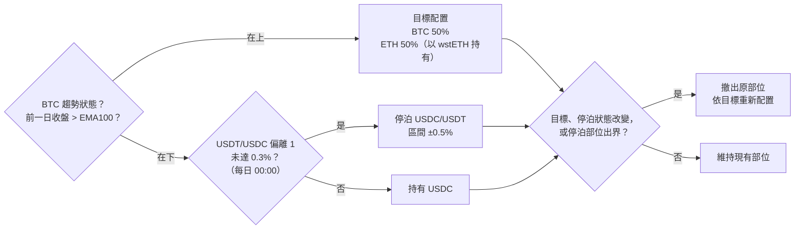
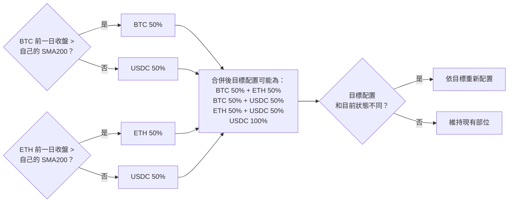

# 下一輪回測計畫：收益層（提案一）與多幣籃子（提案二）

日期：2026-10-05
前置研究：[btc_eth_tri_pool_research.md](btc_eth_tri_pool_research.md)

## 目標

| | 提案一：收益層 | 提案二：各幣自己的趨勢濾網 |
|---|---|---|
| 要回答的問題 | 持有期間把資產放進低無常損失的池子，扣掉成本後實際多賺多少？ | 每個幣只看自己的趨勢，能不能減少「ETH 單獨下跌」的損失，而且不是只在 BTC/ETH 上才有效？ |
| 會影響的決定 | 上線時閒置資金和 ETH 部位要放哪裡 | 上線版本要不要從「BTC 一條濾網」改成「各幣各自判斷」 |
| 資料 | S3 現有的池子，不用另外抓 | BTC/ETH 用 S3；其他幣需要外部日線（2022 年以後） |
| 規則會不會變 | 不變，只改持有方式 | 會變 |

兩個提案都**只用 2022 年以後的資料**，也都**不在新資料上重新挑參數**。

---

## 共用前置：擴充現貨模擬器（1–2 小時）

現有 [`spot_robustness.py`](../samples/strategy-example/spot_robustness.py) 的 `simulate()` 寫死 `eth`、`btc` 兩欄，閒置 USDC 只能設一個固定年化收益。改成：

1. **任意幣數**：權重和價格都用欄位對齊，提案二要用。
2. **每個部位用「總報酬指數」取代價格**：例如 ETH 部位改用 wstETH 的價格，USDC 部位改用停泊池的淨值，提案一要用。
3. **每個部位可以設自己的換幣成本**：提案一多出來的一跳。

驗收：用舊的輸入跑基準，結果要和報告第 12 節完全一樣（+217.1%、−35.8%、61 次交易）。

---

## 提案一：收益層（約半天）

### 期間

四個池子的共同期間是 **2022-08-25 ~ 2025-11-30**。基準要在同一段期間重算，才能互相比較。2026 年的資料大多沒有，所以沒有樣本外。

### 步驟

| # | 工作 | 產出 | 時間 |
|---|---|---|---|
| 1-1 | 把 wstETH/WETH、WBTC/cbBTC、USDC/USDT、DAI/USDT 四個池同步到 backtest 機器，檢查資料品質：有交易的分鐘比例、缺日、2023/3 USDC 脫鉤期間的價格 | 資料品質表 | 30 分鐘 |
| 1-2 | 建立每個部位的總報酬指數： ・USDC：單獨用 demeter 跑停泊池 LP（±0.5%，偏離 0.3% 不停泊，沿用第 7 節的程式），兩個穩定幣池各跑一次 ・ETH：直接持有 wstETH，用池子價格換算；D 版另外跑 wstETH/WETH LP 三種區間 ・BTC：D 版跑 WBTC/cbBTC LP 三種區間（只有 2024-09 以後） | 每日報酬序列 | 寫程式 1–2 小時；demeter LP 共 8 組，在 backtest 機器上背景執行，約 1–3 小時 |
| 1-3 | 組合回測：基準訊號加上各部位的報酬指數，比較下面這張表的版本 | 結果表 | 30 分鐘 |
| 1-4 | 敏感度：gas（用主網 gas 換算，算出這一層划算的最低資金）、換幣成本 5 / 10 bps、扣掉 2023/3 假象 | 敏感度表 | 30 分鐘 |

### 要比較的版本（事先寫死）

| 版本 | USDC 部位 | ETH 部位 | BTC 部位 |
|---|---|---|---|
| A 基準 | USDC | ETH | BTC |
| B 停泊 | USDC/USDT LP | ETH | BTC |
| C 縮小版 | USDC/USDT LP | 持有 wstETH | BTC |
| D 完整版 | USDC/USDT LP | wstETH/WETH LP | WBTC/cbBTC LP（2024-09 以前持有 BTC） |
| B′ | DAI/USDT LP | ETH | BTC |

每一層都要和「直接持有」比，跟第 10 節的拆解一樣。

### D 版的 LP 區間（事先寫死）

三種區間都跑、全部列出，不從中挑選最好的。

| 池子 | 區間 | 出界處理 | 備註 |
|---|---|---|---|
| wstETH / WETH 0.01%（`0x1098…`） | ±0.5%、±1%、±2% | 每日 00:00 檢查，出界就以現價重新置中 | wstETH 匯率每月約漲 0.25%，窄區間會頻繁被推出界 |
| WBTC / cbBTC 0.01%（`0xe8f7…`） | ±0.5%、±1%、±2% | 同上 | 2024-09 以前沒有資料，這段期間 BTC 部位持有現貨 |

做法：用 demeter 單獨跑這兩個池子的 LP，輸出以 ETH 計價和以 BTC 計價的報酬指數，再交給模擬器和濾網訊號組合。**這是近似做法**：它假設 LP 部位一直存在，實際上濾網關閉時會撤出、重新進場時區間會以新價格重設；進出場的換幣成本由模擬器另外扣。

### 資金去處

版本 C：

| 資金去處 | 使用時機 | 白話意思 | LP 區間 |
|---|---|---|---|
| BTC 現貨 | BTC 趨勢濾網開啟 | 直接持有 BTC，不提供流動性 | 無 LP |
| wstETH | BTC 趨勢濾網開啟 | ETH 改持有質押版本，價格跟著 ETH，另外多拿約 3% 的質押收益 | 無 LP |
| USDC / USDT 停泊池 | BTC 濾網關閉，且 USDT / USDC 偏離 1 未達 0.3% | 退出加密資產，在穩定幣池收手續費 | 現價 ±0.5% |
| 持有 USDC | BTC 濾網關閉，且穩定幣匯率偏離達 0.3% | 暫停停泊，等匯率恢復或重新進場 | 無 LP |

其他版本和 C 的差別：

| 版本 | 差別 |
|---|---|
| A 基準 | ETH 持有現貨；濾網關閉時只持有 USDC，不停泊 |
| B 停泊 | ETH 持有現貨，其他同 C |
| B′ | 停泊池改成 DAI / USDT 0.01%，區間 ±0.5%，USDC 要先換成 DAI 和 USDT |
| D 完整版 | ETH 放進 wstETH / WETH LP，BTC 放進 WBTC / cbBTC LP，區間見上一節 |

### 流程（版本 C）

- 已經停泊時如果脫鉤，「停泊狀態改變」成立，會撤出停泊改持 USDC，等匯率恢復再放回去。
- 停泊部位出界很少發生，因為 0.3% 的脫鉤保護通常會先觸發。
- D 版要把右邊的判斷改成「目標、停泊狀態改變，或任一 LP 出界？」。

### 停損點

- 1-1 發現 WBTC/cbBTC 或 wstETH/WETH 的資料不能用：D 版拿掉，只做 A、B、C。
- 1-3 結果 C 比 B 多不到每年 0.5 pt：結論就是「只做停泊」，不再擴充。

---

## 提案二：各幣自己的趨勢濾網

分兩段。第一段不用新資料，先做；第二段要不要做，看第一段的結果和你的決定。

### 流程（兩幣版）

- 和基準的差別：基準只看 BTC 一條濾網，兩個幣一起進出場；這裡每個幣各自判斷，會出現只持有其中一個幣的狀態。
- 2B 加入更多幣時，每個幣都是同樣的一條判斷，比重改成 1 / 幣數。
- 和提案一疊加時，ETH 改以 wstETH 持有，USDC 部分改為停泊。

### 資金去處（兩幣版，單獨測時）

| 資金去處 | 使用時機 | 白話意思 | LP 區間 |
|---|---|---|---|
| BTC 現貨（50%） | BTC 前一日收盤高於自己的 SMA200 | 持有 BTC 這一半 | 無 LP |
| ETH 現貨（50%） | ETH 前一日收盤高於自己的 SMA200 | 持有 ETH 這一半 | 無 LP |
| 持有 USDC | 哪個幣低於自己的 SMA200，那一半就換成 USDC | 只退出走弱的那個幣，另一半照常持有 | 無 LP |

提案二只改「什麼時候進出場」，不改「錢放在哪裡」。

### 2A：用現有的 BTC/ETH 資料做穩健性檢查（1–2 小時）

「兩幣各看自己的 SMA200」在第 12.3 節看起來不錯，但只跑過一組參數。沿用第 12 節的檢查，確認它不是單一參數的巧合：

| 檢查 | 對應的第 12 節小節 |
|---|---|
| 換日時間 UTC 0–23 點 | 12.1 |
| 均線週期 100–250、SMA 與 EMA | 12.2 |
| ETH 單獨下跌那段、2022 年熊市 | 12.3 |
| Block bootstrap，跟基準成對比較 | 12.6 |

**停損點**：如果它只在 SMA200 附近有效，或 bootstrap 顯示它贏過基準的機率不到 60%，提案二就停在這裡。

### 2B：跨資產檢驗（需要外部資料，約半天）

| # | 工作 | 產出 | 時間 |
|---|---|---|---|
| 2-1 | **先寫死幣種名單**：2022-01-01 當時市值前 15 名，排除穩定幣，包含後來崩掉的幣（例如 LUNA）。名單給你確認後才下載 | `universe.csv` | 30 分鐘 |
| 2-2 | 下載 2022 年至今的日線，放在 `samples/real-data/cex/binance/daily/`（不進 git）；抓資料的程式會 commit。檢查缺日和下架日期 | 資料與資料品質表 | 1 小時（已下架幣的資料不好抓時會更久） |
| 2-3 | 每個幣單獨套基準規則（自己的 EMA100），看回撤是否都能砍半 | 每個幣的結果表 | 30 分鐘 |
| 2-4 | 籃子回測，比較事先寫死的三個候選： ・BTC 一條濾網（現在的做法），各幣等權重 ・各幣看自己的 SMA200，等權重 ・各幣看自己的 SMA200，加波動度上限 40% | 結果表、bootstrap | 1–2 小時 |

**要先講清楚的限制**：其他幣跟 BTC 高度相關，所以這不是獨立的證據。它只能告訴我們「效果不是 BTC/ETH 特有的」，沒辦法增加熊市的樣本數（仍然只有 2022 年一次）。

---

## 時程

| 階段 | 工作 | 時間 |
|---|---|---|
| 第 1 段 | 共用前置；1-1 同步池子；1-2 寫好後讓 demeter LP 在背景跑 | 半天 |
| 第 1 段（同時） | 等 LP 跑完的期間做 2A | — |
| 第 2 段 | 1-3、1-4 提案一的組合回測與敏感度；**決策點：2B 要不要做** | 1–2 小時 |
| 第 3 段 | 2B（如果要做） | 半天 |
| 第 4 段 | 寫報告 | 1–2 小時 |

| 範圍 | 預估 |
|---|---|
| 只做提案一 | 約半天到 1 天（含寫報告） |
| 提案一 + 2A | 約 1 天 |
| 全部 | 約 1–1.5 天 |

預估是**我實際工作的時間**，不包括你看結果、做決定的時間。回測本身很快，現貨回測一個設定只要幾秒，整批穩健性檢查幾分鐘。真正要等的只有 demeter 跑 LP，以及 2-2 抓已下架幣的資料。

## 需要你決定的事

1. ~~**開始前**：提案一的 D 版，也就是完整 LP 版，要不要做？~~ 已決定：做（2026-10-05），區間見「D 版的 LP 區間」。
2. ~~**第 2 段結束時**：看完 2A 的結果，決定 2B 要不要做，以及資料要從哪裡抓。~~ 2A 觸發停損點，2B 不做（2026-10-05）。
3. **2-1 完成時**：確認幣種名單，確認後才下載。

執行中新增的決策：1-1 資料品質發現 wstETH/WETH 只有 2024-01 以後、WBTC/cbBTC 只有 2024-10-13 以後可用。已決定（2026-10-05）選項 (a)：A–C 照完整期間跑，另外在 2024-01-01 ~ 2025-11-09 把 A–D 全部重算比較。

結果見 [spot_yield_and_basket.md](spot_yield_and_basket.md)。

## 產出

- 新報告 `reports/spot_yield_and_basket.md`，從原報告第 14 節連過去。
- 程式：擴充後的模擬器，以及提案一、提案二各自的實驗腳本，都放在 `samples/strategy-example/`。
- 結果檔放在 `result/`（不進 git）。
