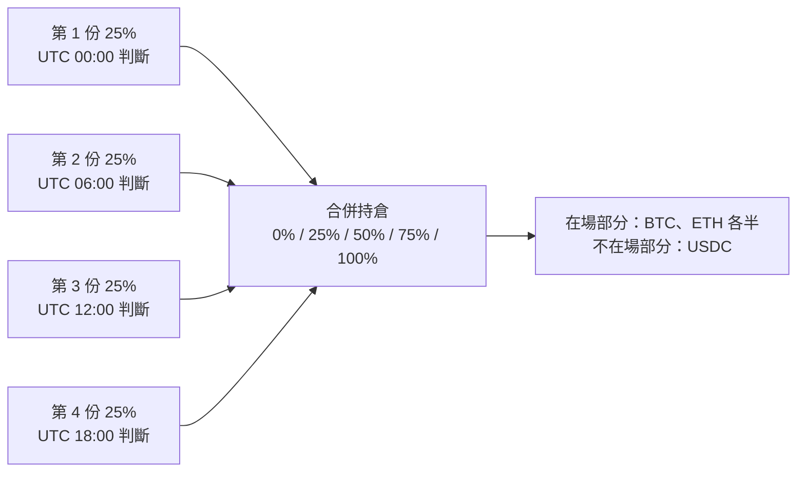

# 現貨濾網的收益層與各幣濾網：回測結果

日期：2026-10-05
計畫：[next_backtest_plan.md](next_backtest_plan.md)（`a65877a` 事先寫死的版本）
前置研究：[btc_eth_tri_pool_research.md](btc_eth_tri_pool_research.md)

## 摘要

- **提案一（收益層）有效，但幅度不大，而且很看資金規模和鏈。**
  - 停泊 USDC/USDT：扣掉 2023/3 的假象後，年化約 **+0.4～1.1 pt**。
  - ETH 改持有 wstETH：在資料乾淨的 2024–2025，年化再多約 **+1.5 pt**。
  - 完整 LP 版（D）：在 2024–2025 年化最多 **+5 pt**，但只有 23 個月的資料，收益集中在少數高波動日，小時資料也會高估約 20%，是最不確定的一個版本。
  - 在主網上，資金 $10k 時 gas 會把所有好處吃光；$100k 以上才划算。「不計 gas」只是低成本情境，不代表 L2：L2 有自己的池子、成交量和流動性，要另外驗證。
- **提案二（各幣看自己的 SMA200）觸發停損點，2B 不做。** 它確實能縮小回撤，也能減少 ETH 單獨下跌時的損失，但 24 個換日時間中只有 1 個的 Calmar 贏過基準，bootstrap 中贏過基準的機率只有 26–37%。第 12.3 節看起來接近基準，只是剛好挑到 UTC 00:00。
- **用波動率濾網決定要不要放 ETH/USDC、WBTC/WETH LP：不可行（第 8 節）。** 低波動的日子 LP 一樣輸給持有現貨，年化約 −1% 到 −13%，每一年分開看也一樣。
- **把換日時間分散成幾個時間點，可以消掉時間點的運氣（第 11 節）。** 份數越多，結果越收斂到約 +220%（24 份、每小時都判斷是 +218%）。3 份（每 8 小時）時最差情況已經是 +211%，好壞差距從 145 pt 縮到 29 pt；6 份（每 4 小時）幾乎完全平均掉。回撤相近，代價是交易次數約多 3～6 倍。建議 3 份或 6 份。
- **wstETH 匯率改成只用過去資料後，C 版的增益還在（第 12 節）。** 短期間比 A 多 +5.0 pt，沒有變化；完整期間從 +30.4 降到 +26.6 pt，差的部分在 2023 年中以前池子幾乎沒成交的那段。
- **波動度上限的好處，大多只是因為持有較少（第 13 節）。** 和平均曝險相同的固定縮減相比，分鐘級回撤只多改善 1～2 pt；報酬有時多、有時少，2026 年都輸給固定縮減。不採用。
- **C 版加上分散時間，扣完鏈上成本後要看資金規模（第 14 節）。** 主網上 $1M 時 C 版分 3 或 6 份都比 A 多約 +5 pt；$100k 時分 3 份還多 +3.1 pt，分 6 份只剩 +0.7 pt；$10k 時所有鏈上版本都不划算。C 版的 gas 主要來自每次換邊都要調整停泊部位。gas 價格到 20 gwei，$100k 分 3 份仍然成立；分 6 份只在 3 gwei 以下划算（第 14.5 節）。
- **建議的上線版本**：基準濾網改成 3 份分散時間（UTC 00、08、16 時），ETH 以 wstETH 持有，出場時停泊 USDC/USDT；主網上資金至少 $100k，$1M 以上可以用 6 份。資金較小時在交易所執行 A 版。D 版放到紙上交易觀察，不直接採用。

---

## 1. 資料品質（`yield_layer.py --quality`）

| 池子 | 可用期間 | 狀況 |
|---|---|---|
| USDC/USDT 0.01%（`0x3416…`） | 2021-11 ~ 2025-11 | 完整，沒有缺日。2023/3 USDC 脫鉤最低到 0.847 |
| DAI/USDT 0.01%（`0x48DA…`） | 2022-07 ~ 2026-01 | 完整，沒有缺日。2023/3 最低到 0.981；2024 年有一筆單一分鐘的 2.23 |
| wstETH/WETH 0.01%（`0x1098…`） | **2024-01 以後** | 2022–2023 年缺 246 天，最長 134 天沒有交易；2024 年以後沒有缺日，最長 2.3 小時沒有交易。2024 年有一筆單一分鐘的 0.78 |
| WBTC/cbBTC 0.01%（`0xe8f7…`） | **2024-10-13 以後** | 一開始缺 11 天，之後正常；價格在 0.994～1.003 之間 |

wstETH/WETH 的年中位數：1.140（2023）→ 1.171（2024）→ 1.205（2025），每年約漲 2.7～2.9%，與質押收益一致。

依計畫的停損點，D 版改在短期間（2024-01-01 ~ 2025-11-09）測試，見計畫的決策紀錄。

## 2. 做法

- **訊號**：與基準完全相同（BTC 收盤高於 EMA100 時持有 ETH 50%、BTC 50%，否則全部 USDC），只改變各部位放在哪裡。
- **模擬器**：新的 [`sleeve_sim.py`](../samples/strategy-example/sleeve_sim.py) 把每個部位當成一條美元價值指數。用 ETH、BTC 價格和現金 = 1 驗收，結果與 `spot_robustness.simulate` 逐小時完全相同（+217.1%、−35.8%、61 次交易）。
- **LP 部位**：[`yield_layer.py`](../samples/strategy-example/yield_layer.py) 先用 Demeter 單獨跑每個 LP，每天 00:00 檢查，出界就重新置中；停泊池偏離 1 達 0.3% 時撤出。淨值變成價值指數，再交給模擬器組合。
  - **近似**：假設 LP 部位一直存在。實際上濾網關閉時會撤出、重新進場時區間會以新價格重設。
- **wstETH 持有（C 版）**：t 時點的匯率是 t 之前最後 21 筆有成交分鐘價格的中位數，只用當時已知的資料；沒有成交的時段沿用最後的值。原本的做法（濾掉離置中 7 日中位數超過 1.5% 的值，再跨缺口內插）會用到之後的價格，見第 12 節。
- **成本**：現貨每筆 10 bps；wstETH 和 LP 部位多一跳，11 bps；進出停泊池 0.5 bp（DAI/USDT 1.5 bp）。
- **gas**：沿用 LP 版每年的 gwei 假設。進場 58 萬 gas、出場 40 萬、重新置中 85 萬、wstETH 換幣 13 萬。結果用資金規模 $10k / $100k / $1M 表示。「不計 gas」是低成本情境，不能直接當成 L2 的結果。

## 3. 各部位單獨的表現（Demeter，小時資料）

| 部位 | 期間 | 年化（以報價幣計） | 重新放置次數 | 單日最大收益 |
|---|---|---|---|---|
| USDC/USDT 停泊 ±0.5% | 2022-08 ~ 2025-11 | +3.0% | 6 | **+2.70%（2023-03-10，脫鉤假象）** |
| DAI/USDT 停泊 ±0.5% | 同上 | +2.0% | 8 | +0.88% |
| wstETH/WETH ±0.5% | 2024-01 ~ 2025-12 | +8.3% | 11 | +2.19%（2024-08-05） |
| wstETH/WETH ±1% | 同上 | +5.4% | 5 | +1.76%（2024-08-05） |
| wstETH/WETH ±2% | 同上 | +3.5% | 2 | +1.34%（2024-08-05） |
| WBTC/cbBTC ±0.5 / 1 / 2% | 2024-10 ~ 2025-11 | +2.3% / +1.4% / +0.9% | 0 | +0.2% |

wstETH/WETH 的報酬以 WETH 計，包含 wstETH 本身的匯率上漲（每年約 2.8%，LP 大約只持有一半的 wstETH）。

### 3.1 小時 vs 分鐘（2025-01-01 ~ 2025-11-09）

| 部位 | 小時 | 分鐘 | 扣掉最好的 3 天（分鐘） |
|---|---|---|---|
| USDC/USDT 停泊 | +0.99% | +0.92% | +0.64% |
| DAI/USDT 停泊 | +1.46% | +1.46% | +1.15% |
| wstETH/WETH ±0.5% | **+7.84%** | **+6.34%** | +3.37% |
| wstETH/WETH ±1% | +5.03% | +4.07% | +2.25% |
| wstETH/WETH ±2% | +2.96% | +2.55% | +1.53% |
| WBTC/cbBTC ±0.5% | +1.20% | +1.18% | +0.92% |

- 停泊池和 WBTC/cbBTC：小時和分鐘幾乎一致。
- **wstETH/WETH：小時高估約 20%**，而且收益集中在 2025-02-03 一天（分鐘 +2.3%）。2024 年也集中在 2024-08-05。兩天都是市場大跌、wstETH/WETH 價格錯位的日子。這可能是真的套利成交量，也可能是第 7.4 節的成交量歸屬假象，回測無法分辨。

## 4. 組合結果

### 4.1 完整期間 2022-08-27 ~ 2025-11-30（不計 gas）

| 版本 | 總報酬 | 年化 | 最大回撤 | 比 A 多（pt） |
|---|---|---|---|---|
| A 基準 | +214.5% | +42.1% | −35.8% | — |
| B 停泊 USDC/USDT | +231.2% | +44.4% | −35.8% | +16.7 |
| B 停泊，扣掉 2023/3 | +222.5% | +43.2% | −35.8% | **+8.0** |
| B′ 停泊 DAI/USDT | +229.0% | +44.1% | −35.7% | +14.5 |
| B′ 停泊 DAI，扣掉 2023/3 | +217.8% | +42.6% | −35.7% | +3.3 |
| C wstETH + 停泊 | +241.1% | +45.7% | −35.7% | +26.6 |

C 比 B 多 9.9 pt，但 wstETH/WETH 池子在 2023 年中以前幾乎沒有成交，那段的匯率大多沿用最後成交價，這部分是估值，不是在這個池子實際做得到的交易。舊版匯率（會用到之後的價格）是 +244.9%、+30.4 pt，見第 12 節。

### 4.2 短期間 2024-01-01 ~ 2025-11-09（不計 gas，資料都乾淨）

| 版本 | 總報酬 | 年化 | 最大回撤 | Calmar | 比 A 多（pt） |
|---|---|---|---|---|---|
| A 基準 | +103.7% | +46.7% | −35.8% | 1.30 | — |
| B 停泊 USDC/USDT | +104.8% | +47.1% | −35.8% | 1.32 | +1.1 |
| B′ 停泊 DAI/USDT | +104.9% | +47.2% | −35.7% | 1.32 | +1.2 |
| C wstETH + 停泊 | +108.6% | +48.6% | −35.7% | 1.36 | **+5.0** |
| D 完整 LP ±0.5% | +117.1% | +51.8% | −34.5% | 1.50 | +13.4 |
| D ±0.5%，扣掉兩個崩盤日＊ | +115.3% | +51.1% | −35.0% | 1.46 | +11.6 |
| D 完整 LP ±1% | +112.4% | +50.0% | −35.0% | 1.43 | +8.7 |
| D ±1%，扣掉兩個崩盤日＊ | +111.1% | +49.6% | −35.3% | 1.40 | +7.4 |
| D 完整 LP ±2% | +109.4% | +48.9% | −35.4% | 1.38 | +5.8 |
| D ±2%，扣掉兩個崩盤日＊ | +108.7% | +48.6% | −35.6% | 1.37 | +5.0 |

＊2024-08-05 和 2025-02-03，看過各部位的結果之後才挑出來的。扣掉後影響不大，因為那兩天濾網大多是關閉的，ETH 部位本來就不在場。

### 4.3 gas（比 A 多的 pt）

| 版本 | 期間 | 不計 gas | $10k | $100k | $1M |
|---|---|---|---|---|---|
| B 停泊，扣掉 2023/3 | 完整 | +8.0 | **−8.4** | +6.3 | +7.8 |
| C wstETH + 停泊 | 完整 | +26.6 | +5.4 | +24.5 | +26.4 |
| B 停泊 | 短 | +1.1 | **−3.8** | +0.6 | +1.1 |
| C wstETH + 停泊 | 短 | +5.0 | **−1.4** | +4.4 | +4.9 |
| D ±0.5% | 短 | +13.4 | **−4.2** | +11.7 | +13.3 |
| D ±2% | 短 | +5.8 | **−9.3** | +4.2 | +5.6 |

$10k 時 D 版的最大回撤也從 −34.5% 惡化到 −38.0%，因為重新置中的 gas 在下跌時照付。

## 5. 提案二 2A：各幣看自己的 SMA200（`each_gate_check.py`）

### 5.1 換日時間 UTC 0–23（與同一時間的基準比）

| | 各幣 SMA200 贏過基準的次數 |
|---|---|
| Calmar | **1 / 24** |
| 總報酬 | **0 / 24** |
| 最大回撤較小 | 20 / 24 |
| ETH 單獨下跌那段虧較少 | 19 / 24 |

各幣 SMA200 的 4 年總報酬在 +81% ~ +152% 之間，基準是 +165% ~ +310%。差距主要在 2025 年：各幣規則大約 −3% ~ −20%，基準 +9% ~ +45%。

### 5.2 均線類型與週期（100–250）

- 跟同週期的 BTC 濾網比：Calmar 有 10/16 贏（SMA 和 EMA 都是），但總報酬幾乎全輸（SMA 0/16、EMA 1/16）。這是因為長週期的 BTC 濾網本身就很差（回撤 −45% ~ −54%）。
- 跟基準（EMA100 BTC 濾網，Calmar 0.93）比：只有 SMA130 達到，EMA 沒有任何週期達到。

### 5.3 Bootstrap（各幣 SMA200 減基準，2022–2025 每日報酬，成對重抽 2000 次）

| 區塊長度 | 年化報酬差中位數 | 贏過基準的機率：報酬 / 回撤 / Calmar |
|---|---|---|
| 20 天 | −6.5% | 28% / 62% / 37% |
| 60 天 | −6.6% | 26% / 64% / 36% |
| 120 天 | −6.5% | 26% / 66% / 37% |

### 5.4 判定

依計畫事先寫好的停損點（只在 SMA200 附近有效，或 bootstrap 贏過基準的機率低於 60%），**提案二停在 2A，2B 不做**。它是一個「用報酬換回撤」的規則，而且換得不划算：回撤只少約 2–3 pt，報酬每年少約 6.5 pt。

## 6. 結論

### 可以採用的

1. **停泊 USDC/USDT**：扣掉假象後，完整期間年化多約 1.1 pt，短期間約 0.4 pt。實際收益應該是正的，只是不大。DAI/USDT 在扣掉假象後比較差（+3.3 pt 對 +8.0 pt），沒有理由換。
2. **ETH 以 wstETH 持有**：短期間比只停泊多約 3.9 pt（年化約 1.5 pt）。這主要是質押收益，模型風險低，gas 只有換幣。
3. **兩者合起來（C 版）**是目前最實際的上線版本：主網資金 $100k 以上時，短期間年化多約 1.7～1.9 pt，回撤不變。加上 3 份分散時間後，$100k 時仍多約 3 pt（第 14 節）。

### 要謹慎看待的

4. **D 版（完整 LP）**：短期間 ±0.5% 年化多約 5 pt，回撤略小（−34.5%）。但是：
   - 只有 23 個月的資料，而且大多是多頭；
   - 小時資料高估 wstETH/WETH LP 約 20%。粗估修正後，±0.5% 大約剩 +9～10 pt，這是推算，沒有實際重跑；
   - 收益集中在高波動日，無法排除成交量歸屬的假象；
   - 三種區間的排序（±0.5% > ±1% > ±2%）和「窄區間分到較多手續費」一致，但窄區間也最容易被高估；
   - WBTC/cbBTC 那一半的貢獻很小（年化 1–2%，而且只持有半年多）。
   建議放到紙上交易觀察，不直接採用。
5. **主網上資金小於 $100k 時不要做任何一層**：$10k 時短期間所有版本都比基準差。
6. **wstETH 的脫鉤風險只測到一部分**：2022/6 的 stETH 折價在資料開始之前；2022-11 約 −3.3% 的折價現在有算進去（第 12 節）。出場當下遇到折價、流動性下降的壓力情境還沒測。

### 不採用的

7. **各幣看自己的 SMA200**：2A 未通過，見第 5 節。
8. **低波動時把現貨換成 ETH/USDC 或 WBTC/WETH LP**：診斷未通過，見第 8 節。
9. **波動度上限**：和平均曝險相同的固定縮減比，多出來的好處小而且不穩定，見第 13 節。

## 7. 限制

- 短期間只有 23 個月，沒有熊市。
- LP 部位用「一直存在」的價值指數近似，沒有模擬濾網關閉時撤出、重新進場時重設區間。
- 停泊池的脫鉤保護只在 00:00 檢查，所以 2023-03-10 盤中的脫鉤仍然被算進去，另外列出扣掉的版本。
- gas 是粗估，沒有用實際的交易紀錄。
- 2026 年的資料沒有用到：這些池子大多到 2025 年底就結束了。

## 8. 補充：波動率濾網能不能讓 ETH/USDC、WBTC/WETH LP 回來（`vol_lp_check.py`）

### 8.1 問題與做法

LP 的收入是手續費，成本是無常損失，而無常損失跟波動率的平方成正比。所以想法是：波動低、價格來回震盪時，也許手續費能贏過無常損失，這時把現貨換成 LP。

在設計策略之前先做診斷：

- 用 Demeter 一直開著兩個 LP，區間跟 LP 版一樣：ETH/USDC 0.05% ±20%、WBTC/WETH 0.05% ±10%。每天 00:00 檢查，出界就重新置中。期間 2022-01 ~ 2026-09，小時資料。
- 每天算「LP 報酬 − 持有 LP 當天 00:00 那個幣種組成的現貨報酬」，也就是當天的手續費 − 無常損失 − 重建成本。
- 依當天 00:00 就知道的過去 30 天實際波動率，把每天分成五組（第 1 組最低），分成「全部日子」和「BTC 濾網開啟的日子」兩種看，因為只有濾網開啟時才會考慮把現貨換成 LP。
- 判定條件事先定好：低波動的組別要在每一年都穩定為正，才繼續設計策略。

### 8.2 結果：每組的平均超額報酬（年化）

| 波動率組別 | ETH/USDC 全部日子 | ETH/USDC 濾網開啟 | WBTC/WETH 全部日子 | WBTC/WETH 濾網開啟 |
|---|---|---|---|---|
| 1（最低） | −7.0% | −1.2% | −3.6% | −0.7% |
| 2 | −9.0% | −12.6% | −7.1% | −12.0% |
| 3 | +0.3% | +1.2% | +0.2% | −3.3% |
| 4 | −0.9% | −0.5% | −6.6% | −11.8% |
| 5（最高） | −13.0% | −10.7% | −12.1% | −14.9% |
| 全部 | −5.9% | | −5.8% | |

各組的波動率範圍：ETH/USDC 第 1 組 15–47%、第 5 組 84–127%；WBTC/WETH（ETH/BTC 比價）第 1 組 8–23%、第 5 組 45–71%。

**低波動（第 1–2 組）、濾網開啟的日子，逐年來看：**

| 年份 | ETH/USDC | WBTC/WETH |
|---|---|---|
| 2022 | −43.3%（4 天） | +1.5%（16 天） |
| 2023 | −4.6% | −2.7% |
| 2024 | −15.3% | −22.5% |
| 2025 | −25.0% | 沒有低波動的日子 |
| 2026 | +11.1%（43 天） | +5.5%（47 天） |

### 8.3 判定

- **低波動的日子 LP 一樣輸。** 只有中間那一組接近 0，看不出「波動越低 LP 越好」的關係。
- **每一組都有大約 65–75% 的日子 LP 小贏，但平均是負的。** 平常每天賺一點手續費，少數大波動的日子一次虧回去，而過去 30 天的波動率預測不了這些日子。
- **只有 2026 年是正的**，而且只有四十幾天，不足以推翻前面四年。
- 這和第 10 節「LP 層 4 年少 14～68 pt」的結論一致，而且這裡用的是會高估 LP 手續費的回測，修正後只會更差。

依照事先定好的條件，**這個方向不往下設計策略**。ETH/USDC 和 WBTC/WETH 只用來換算 BTC 價格和換幣，不做 LP。

## 9. 同一段期間：同價資產 LP 對上舊的 LP 版（`lp_versions_window.py`）

舊 LP 版（ETH/USDC + WBTC/WETH）用 `tri_btc_eth_gate.py` 在 D 版的期間 2024-01-01 ~ 2025-11-09 重跑。濾網都是 BTC EMA100，都扣主網 gas、資金 $100k。

| 策略 | 濾網開啟時放哪裡 | 總報酬 | 年化 | 最大回撤 |
|---|---|---|---|---|
| D 版 | WBTC/cbBTC LP ±0.5% + wstETH/WETH LP ±0.5%，出場停泊 | **+115.3%** | 約 +51% | −34.5% |
| C 版 | BTC 現貨 + wstETH，出場停泊 | +108.0% | 約 +48% | −35.7% |
| 舊 LP 版：follow + 停泊 + 遲滯 1% | ETH/USDC + WBTC/WETH，依 ETH/BTC 強弱 75/25 或 25/75 | +75.8% | 約 +35% | −31.1% |
| 舊 LP 版：follow | 同上，不停泊 | +70.6% | 約 +33% | −34.8% |
| 舊 LP 版：固定 50/50 + 停泊 | ETH/USDC 50% + WBTC/WETH 50% | +33.8% | 約 +17% | −30.4% |
| 舊 LP 版：固定 50/50 | 同上，不停泊 | +33.6% | 約 +17% | −30.4% |
| 持有 50% BTC + 50% ETH | — | +102.5% | 約 +46% | −44.6% |

- D 版比舊 LP 版最好的設定多約 40 pt，C 版多約 32 pt。C 版沒有手續費高估的問題，所以「不再用 ETH/USDC、WBTC/WETH 做 LP」這個結論不依賴 D 版的數字。
- 舊 LP 版的回撤比較小，是因為曝險比較低：ETH/USDC ±20% 的部位大約一半是 USDC，濾網開啟時加密資產只佔 60–86%；C、D 版接近 100%。
- 成本算法不完全相同：舊 LP 版換幣走池子付 0.05% 加 gas；C、D 版現貨交易每筆 10 bps，鏈上部位另計 gas。
- 舊 LP 版這段的結果和前次起始月份測試一致：前次 `follow_park_band1` 從 2024-01 起跑到 2025-12-31 是 +75.9%。

## 10. D 版兩個池子的成交量與容量（`lp_capacity.py`）

### 10.1 日成交量

| 池子 | 手續費率 | 2023 | 2024 | 2025 | 有成交的分鐘（2025） |
|---|---|---|---|---|---|
| wstETH/WETH | 0.01% | 約 5,600 WETH（約 $1,000 萬） | 約 12,900 WETH（約 $4,000 萬） | 約 4,700 WETH（約 $1,400 萬） | 23% |
| WBTC/cbBTC | 0.01% | — | 約 220 BTC（約 $1,700 萬，只有第四季） | 約 260 BTC（約 $2,600 萬） | 17% |
| 對照：ETH/USDC | 0.05% | $2.26 億 | $2.09 億 | $1.04 億 | 93% |
| 對照：WBTC/WETH | 0.05% | $2,700 萬 | $5,100 萬 | $2,000 萬 | 59% |
| 對照：USDC/USDT | 0.01% | 約 $5,900 萬 | 約 $4,800 萬 | 約 $2,600 萬 | 61% |

日成交量是中位數（第 1 節的資料品質檢查），美元是用當年大概的 ETH、BTC 價格換算的。2025-01-01 ~ 2025-11-09 的日平均：wstETH/WETH 約 $2,270 萬、WBTC/cbBTC 約 $3,630 萬；平均高於中位數，代表成交量集中在少數日子。整個池子每天的手續費約 $2,300（wstETH/WETH）和 $3,600（WBTC/cbBTC），由所有 LP 分。

- 量級對 $5 萬到 $50 萬的部位夠用，但手續費率只有 ETH/USDC 的五分之一，總手續費少很多。
- 只有約兩成的分鐘有成交，成交集中在少數時段。
- wstETH/WETH 2025 年的量大約只有 2024 年的三分之一。

### 10.2 資金規模對手續費收益率的影響

做法：2025-01-01 ~ 2025-11-09 的每一分鐘，池子手續費 = 成交量 × 0.01%，我們分到的比例 = 我們的流動性 ÷（池子當時的流動性 + 我們的流動性），部位一直以當下價格為中心、±0.5%。只算手續費，不含無常損失和 wstETH 匯率上漲，也一樣假設成交都經過我們的區間，所以水準偏高，重點是隨規模的變化。

| 資金 | wstETH/WETH 手續費年化 | 平均佔比 | WBTC/cbBTC 手續費年化 | 平均佔比 |
|---|---|---|---|---|
| $1 萬 | 9.3% | 0.09% | 1.4% | 0.01% |
| $10 萬 | 6.8% | 0.71% | 1.4% | 0.08% |
| $100 萬 | 2.9% | 3.2% | 1.3% | 0.8% |
| $1,000 萬 | 1.0% | 12.0% | 1.1% | 7.0% |

- **WBTC/cbBTC 很深**：到 $100 萬收益率幾乎不變，但只有 1.3～1.4%。
- **wstETH/WETH 很淺**：佔比還不到 1% 時，收益率就從 9.3% 掉到 6.8%。這表示有相當一部分手續費發生在池子流動性很薄的時刻，小部位在那幾分鐘能分到很大的比例。這跟第 3.1 節「收益集中在崩盤日」一致，也是回測高估的來源之一。
- **對 D 版的影響**：資金越大，wstETH/WETH LP 的手續費越接近 1～3%，跟直接持有 wstETH 的質押收益差不多，D 版相對 C 版的優勢會消失。回測裡 ETH 部位約 $5 萬，剛好落在收益率最高的區間。

### 10.3 資金夠大時，ETH/USDC、WBTC/WETH 會不會反過來比較好？

不會。LP 比持有現貨多賺的部分是「手續費收益率 − 無常損失率」：無常損失率只看價格怎麼動，跟資金大小無關；手續費收益率則會隨資金變大而下降。所以資金放大只會讓差額更負。

用同樣的方法算舊 LP 版兩個池子的手續費收益率：

| 資金規模 | ETH/USDC ±20% | WBTC/WETH ±10% | wstETH/WETH ±0.5% | WBTC/cbBTC ±0.5% |
|---|---|---|---|---|
| $1 萬 | 63.6% | 54.0% | 9.3% | 1.4% |
| $10 萬 | 63.4% | 52.8% | 6.8% | 1.4% |
| $100 萬 | 61.5% | 44.8% | 2.9% | 1.3% |
| $1,000 萬 | 49.2% | 23.7% | 1.0% | 1.1% |

ETH/USDC、WBTC/WETH 的手續費看起來很高，但無常損失更高：第 8 節在約 $5 萬的規模下，扣掉無常損失後一年仍少 5.9% 和 5.8%。假設無常損失率不變，用手續費收益率的下降幅度推算：

| 資金規模 | ETH/USDC LP 比持有現貨多賺 | WBTC/WETH LP 比持有現貨多賺 |
|---|---|---|
| 約 $5 萬（第 8 節實測） | −5.9%/年 | −5.8%/年 |
| $100 萬（推算） | 約 −8%/年 | 約 −15%/年 |
| $1,000 萬（推算） | 約 −20%/年 | 約 −36%/年 |

- **沒有臨界點**：任何規模下，舊 LP 版這兩個池子都輸給持有現貨，資金越大輸越多。
- **資金規模真正影響的是 D 版和 C 版的差距**：$10 萬以下 D 版 > C 版 > 舊 LP 版（主網 $1 萬時要扣 gas，C 版最好）；$100 萬以上 D 版 ≈ C 版 > 舊 LP 版。
- 這些手續費數字同樣假設成交都經過我們的區間，所以偏高；改用更貼近現實的數字，ETH/USDC、WBTC/WETH 只會更差。

## 11. 分散換日時間與 EMA 週期（`ensemble_gate.py`）

### 11.1 問題與做法

報告第 12.1 節發現，同一條規則只換「哪個小時的價格當作日收盤」，2022–2025 的 4 年報酬就從 +165% 到 +310%。這個差距幾乎全是時間點的運氣。

做法：把資金分成幾份，每份用不同的換日時間或 EMA 週期各自判斷，整體持有各份的平均。轉折時會分批進出場。事先寫死四種設計，全部列出：

| 設計 | 份數 | 內容 |
|---|---|---|
| 原本 | 1 | UTC 00 時、EMA100 |
| 分散時間 | 4 | UTC 00、06、12、18 時 × EMA100 |
| 分散 EMA | 4 | UTC 00 時 × EMA 90、110、130、150 |
| 兩個都分散 | 16 | 上面 4 × 4 |

穩定度的量法：把整組換日時間一起往後平移（原本和分散 EMA 平移 0–23 小時，分散時間和兩個都分散平移 0–5 小時，之後就重複了），看結果的範圍。現貨、每筆 10 bps，2022–2025。原本的設計在平移 0 時重現了 +217.1%、61 次交易。



### 11.2 結果

| 設計 | 4 年總報酬（最差 / 中位 / 最好） | 好壞差距 | 最大回撤（最差 / 中位 / 最好） | Calmar 中位 | 2026（中位） | 交易次數（中位） |
|---|---|---|---|---|---|---|
| 原本 | +165% / +230% / +310% | 145 pt | −40% / −36% / −30% | 0.94 | +3% | 63 |
| **分散時間** | **+210% / +215% / +255%** | **44 pt** | −36% / −35% / −33% | 0.95 | +3% | 258 |
| 分散 EMA | +158% / +205% / +244% | 85 pt | −39% / −37% / −33% | 0.90 | +9% | 125 |
| 兩個都分散 | +188% / +203% / +207% | 18 pt | −36% / −36% / −34% | 0.89 | +8% | 500 |

### 11.3 判定

- **分散時間的取捨最好**：好壞差距從 145 pt 縮到 44 pt，最差情況從 +165% 提高到 +210%，中位數略低（+215% 對 +230%），回撤相近。交易次數約多 4 倍，但每筆只有 1/4，扣完每筆 10 bps 的成本後仍然成立。
- **分散 EMA 效果最差**：最差情況（+158%）比原本還低，好壞差距也還有 85 pt。分散週期沒有處理到時間點的運氣。
- **兩個都分散最穩定**（差距只有 18 pt），但中位數最低，交易次數約 8 倍。
- **執行方式**：在交易所或 L2 上，多出來的交易影響不大；在主網上每筆都要付 gas，資金小時不划算。
- 這不會提高預期報酬，只是讓結果比較不取決於挑中哪個時間點。

### 11.4 份數要多少（看過 4 份的結果後追加）

時間平均分配，EMA100：

| 份數（每隔幾小時一份） | 平移方式 | 4 年總報酬（最差 / 中位 / 最好） | 好壞差距 | 最大回撤中位 | 交易次數（中位） |
|---|---|---|---|---|---|
| 1（只看 00 時） | 24 | +165% / +230% / +310% | 145 pt | −36% | 63 |
| 2（每 12 小時） | 12 | +183% / +226% / +275% | 92 pt | −35% | 128 |
| 3（每 8 小時） | 8 | +211% / +224% / +239% | 29 pt | −34% | 192 |
| 4（每 6 小時） | 6 | +210% / +215% / +255% | 44 pt | −35% | 258 |
| 6（每 4 小時） | 4 | +224% / +224% / +225% | 2 pt | −35% | 381 |
| 8（每 3 小時） | 3 | +210% / +224% / +229% | 19 pt | −35% | 508 |
| 12（每 2 小時） | 2 | +219% / +222% / +225% | 5 pt | −35% | 765 |
| 24（每小時） | 1 | +218% | 0 | −35% | 1,530 |

- **結果收斂到約 +218～225%**：24 份等於每個小時都判斷，完全沒有時間點的運氣，是 +218%。原本只看 00 時的 +217% 剛好接近平均。
- **好壞差距不是每次都比上一個小**：份數越多，能平移的方式越少（6 份只有 4 種、8 份只有 3 種），差距本身的雜訊很大，不要把 6 份的 2 pt 當成特別好。大方向是 3 份以上，最差情況都在 +210% 以上。
- **建議 3 份或 6 份**：3 份（UTC 00、08、16 時）交易次數約 3 倍，已經消掉大部分的運氣，主網上執行時比較適合；6 份（每 4 小時）幾乎完全平均掉，交易次數約 6 倍，適合在交易所或 L2 上執行。8 份以上交易太多，沒有多換到什麼。
- 這一組是看過 4 份的結果才追加的，但各份數的報酬都收斂到 +220% 左右，選哪個主要看執行成本，不是看報酬。
- 建議上線版本（C 版）的濾網改用 3 份或 6 份的分散時間。扣完鏈上成本後怎麼選，見第 14 節。

## 12. wstETH 匯率只用過去資料（`yield_layer.wsteth_ratio`）

### 12.1 原本的問題

原本的匯率有兩處會用到當時還不知道的價格：

- 濾掉離群值用的是**置中**的 7 日中位數，最多看到 3.5 天之後的價格；
- 沒有成交的時段用**跨缺口內插**，會用到缺口之後的價格；開頭還用了 `bfill()`。

另外，用「偏離中位數超過 1.5% 就刪掉」的濾法，會把真實的折價一起刪掉。

### 12.2 資料實際的樣子

- 2022 年整年只有 84 個有成交的分鐘；2023 年 1–3 月有 70 天、2–6 月有 134 天沒有成交。2023 年中以前的 C 版主要是估值，不是在這個池子實際做得到的交易。
- 2022-11（FTX 那週），成交價在 1.058 和 1.094 之間來回跳，約 −3.3%。舊的濾網把這些全部刪掉了。
- 2024-08-05 大跌時有單筆異常的成交（0.78、0.95），前後都回到 1.15 附近。

### 12.3 新的做法

- **因果版（現在的預設）**：t 時點的匯率是 t 之前最後 21 筆有成交分鐘價格的中位數；分鐘 m 的收盤從 m+1 起才可用。單筆異常成交移動不了中位數；持續的折價佔了大多數成交後，就會反映出來。沒有成交的時段沿用最後的值，所以長缺口裡累積的質押收益會在恢復交易時一次反映。
- **原始價格版**：t 之前最後一筆成交價，不做任何清理，當作對照。
- 21 筆是跑之前就定好的，沒有試其他數字。

### 12.4 結果（比 A 多的 pt）

| 期間 | 匯率 | 不計 gas | $10k | $100k | $1M |
|---|---|---|---|---|---|
| 完整 | 舊（置中、內插） | +30.4 | +9.2 | +28.3 | +30.2 |
| 完整 | **因果** | **+26.6** | +5.4 | +24.5 | +26.4 |
| 完整 | 原始價格 | +26.7 | +5.5 | +24.5 | +26.4 |
| 短 | 舊（置中、內插） | +5.0 | −1.3 | +4.4 | +4.9 |
| 短 | **因果** | **+5.0** | −1.4 | +4.4 | +4.9 |
| 短 | 原始價格 | +5.0 | −1.3 | +4.4 | +5.0 |

- 舊版的數字和第 4 節完全一致，所以差異只來自匯率的算法。
- **前視只影響完整期間**，約 4 pt，集中在幾乎沒有成交的那段；短期間沒有變化。
- 因果版和完全不清理的原始價格只差 0.05 pt，所以清理方式不影響結論，也沒有藏起折價。
- 最大回撤三種都是 −35.7%。
- 還沒做的：把質押累積（鏈上的 `stEthPerToken`）和市場折價分開，以及出場當下遇到折價的壓力測試。

## 13. 波動度上限 vs 曝險相同的固定縮減（`exposure_check.py`）

### 13.1 問題與做法

前次報告第 12.5 節的 40% 波動度上限把回撤從 −36% 降到 −26%～−28%。但它平均持有的加密資產也比較少，而少持有本身就會降低回撤。所以每一種上限都配一個「固定縮減」的對照：

- **固定縮減**：濾網和基準相同，只是 ETH（或兩幣）的比重乘上一個固定倍數，其餘放 USDC，只在濾網切換時交易。
- **怎麼配對**：倍數用二分法找，讓 2022–2025 **實際持倉**（含價格漂移）的時間平均曝險和對應的上限版本相同。不是用目標權重平均。
- 這個倍數只是診斷用的對照，**不是上線參數**。
- 回撤以分鐘級為準；2026 年只看，不用來選。

### 13.2 結果（分鐘級，2022–2025）

| 規則 | 平均曝險 | 4 年合計 | 最大回撤 | Calmar | 最差月 | 最差季 | 最長水下天數 | ETH 單獨下跌 | 2026 | 交易次數 |
|---|---|---|---|---|---|---|---|---|---|---|
| 基準 | 56.1% | +217% | −36.2% | 0.92 | −16.7% | −23.1% | 291 | −33.1% | +2.0% | 61 |
| 上限 40%，只調 ETH | 48.4% | +188% | −28.7% | 1.06 | −13.0% | −15.9% | 293 | −24.7% | +0.6% | 79 |
| 固定：ETH × 0.658 | 48.4% | +179% | −30.9% | 0.95 | −14.7% | −17.6% | 291 | −26.7% | +3.1% | 61 |
| 上限 40%，兩幣都調 | 44.3% | +169% | −28.7% | 0.98 | −11.8% | −14.5% | 285 | −22.3% | +0.2% | 88 |
| 固定：兩幣 × 0.742 | 44.3% | +158% | −29.7% | 0.90 | −14.1% | −18.2% | 291 | −27.0% | +1.8% | 61 |
| 上限 60%，只調 ETH | 53.8% | +198% | −32.7% | 0.96 | −16.1% | −20.8% | 291 | −29.5% | +1.1% | 72 |
| 固定：ETH × 0.893 | 53.8% | +206% | −34.2% | 0.94 | −15.7% | −21.4% | 291 | −31.2% | +2.4% | 61 |
| 上限 60%，兩幣都調 | 53.5% | +195% | −32.7% | 0.95 | −16.1% | −20.8% | 291 | −29.3% | +1.1% | 72 |
| 固定：兩幣 × 0.941 | 53.5% | +204% | −34.8% | 0.92 | −16.0% | −22.0% | 291 | −31.8% | +2.0% | 61 |

上限版本減掉對應的固定縮減（pt，正數代表上限較好）：

| 上限 | 4 年合計 | 最大回撤 | 最差季 | ETH 單獨下跌 | 2026 |
|---|---|---|---|---|---|
| 40%，只調 ETH | +8.8 | +2.3 | +1.7 | +2.1 | −2.5 |
| 40%，兩幣都調 | +11.1 | +1.0 | +3.7 | +4.7 | −1.7 |
| 60%，只調 ETH | −8.5 | +1.5 | +0.6 | +1.7 | −1.3 |
| 60%，兩幣都調 | −8.4 | +2.1 | +1.2 | +2.5 | −0.9 |

### 13.3 判定

- **回撤的改善大多只是因為持有較少**：40% 兩幣都調時，回撤從 −36.2% 降到 −28.7%（7.5 pt），其中約 6.5 pt 固定縮減也拿得到，上限只多 1.0 pt。
- **小時級高估了上限的效果**：−25.7% 換成分鐘級是 −28.7%，是所有規則裡退步最多的。
- **報酬方向不一致**：40% 比對照多約 10 pt，60% 反而少約 8 pt，比較像雜訊，不像穩定的優勢。
- 最差季和 ETH 單獨下跌那段，上限版本好 1～5 pt；最長水下天數沒有差別，是同一段（約 290 天）。
- 2026 年四組都是固定縮減比較好。
- **不採用波動度上限**：多出來的效果小而且不穩定，不值得多出來的交易和規則。如果想要回撤小一點，固定少持有一些就能拿到大部分的效果；這個倍數要另外決定，不能用這裡配對出來的數字。

## 14. A／C 版 × 1／3／6 份：鏈上完整成本（`cost_matrix.py`）

### 14.1 問題與做法

第 4 節（收益層）和第 11 節（分散時間）各自成立，但分散時間是用每筆 10 bps 測的。合在一起之後，每次有一份換邊都要付換幣、停泊進出和 gas，還剩多少？

- **份數**：1、3、6 份，換日時間平均分配（每 24/n 小時一份），EMA100。整組時間一起平移所有 offset（1 份 24 種、3 份 8 種、6 份 4 種），看結果範圍。同一小時改變的各份合併成一筆淨交易。
- **版本**：
  - A 交易所：每筆 10 bps，不計 gas（第 11 節的設定）。
  - A 鏈上：同上，但每次買賣 ETH 或 BTC 付一次 swap 的 gas（13 萬）。
  - C 鏈上：wstETH 11 bps、兩次 swap 的 gas；BTC 一次 swap；閒置 USDC 放停泊池。停泊池進場 58 萬 gas、出場 40 萬、加碼 58 萬、部分取出 40 萬，持有期間每次重新置中 85 萬。wstETH 用第 12 節的因果匯率。
- **gas**：沿用每年的 gwei 假設（2022 年 40、2023 年 30、2024 年 15、2025 年 3）和當時的 ETH 價格；資金 $10k / $100k / $1M，另外加一組不計 gas 的低成本情境。
- **驗收**：1 份、offset 0、不計 gas 時，A 和 C 都重現第 4 節的數字（完整期間 +214.5% / +241.1%，短期間 +103.7% / +108.6%）。
- `sleeve_sim.simulate` 新增 `resize="split"`，把加碼和部分取出分開計 gas；以前所有部分調整都算成重新置中（85 萬）。預設不變，第 4 節的結果不受影響。

### 14.2 短期間 2024-01-01 ~ 2025-11-09（資料都乾淨）

總報酬是所有 offset 的中位數（括號是最差～最好）。A 鏈上和 A 交易所比；C 和同資金的 A 鏈上比，不計 gas 時和 A 交易所比。

| 資金 | 份數 | A 鏈上 | A 鏈上比 A 交易所 | C 鏈上 | C 比 A 鏈上 | C 的 gas（中位數） |
|---|---|---|---|---|---|---|
| 不計 gas | 1 | +107%（+78 ~ +140） | — | +112%（+83 ~ +146） | +5.2 | — |
| 不計 gas | 3 | +111%（+99 ~ +119） | — | +116%（+104 ~ +125） | +5.3 | — |
| 不計 gas | 6 | +108%（+105 ~ +112） | — | +113%（+110 ~ +118） | +5.2 | — |
| $1M | 1 | +107% | −0.0 | +112% | +5.1 | $77 |
| $1M | 3 | +111% | −0.1 | +116% | +5.0 | $228 |
| $1M | 6 | +108% | −0.2 | +113% | +4.7 | $460 |
| $100k | 1 | +107% | −0.3 | +111% | +4.4 | $767 |
| $100k | 3 | +110% | −0.9 | +113% | **+3.1** | $2,280 |
| $100k | 6 | +106% | −1.8 | +107% | **+0.7** | $4,597 |
| $10k | 1 | +104% | −3.0 | +101% | −2.2 | $7,668 |
| $10k | 3 | +102% | −9.1 | +85% | −16.9 | $22,803 |
| $10k | 6 | +90% | −18.2 | +51% | −39.3 | $45,968 |

gas 欄是以 $100k 為基準的模擬帳上金額；資金 $10k 時實際付的金額是十分之一，但佔資金的比例是十倍。最大回撤的中位數，在不計 gas、$1M、$100k 時都約 −33% ~ −36%；$10k 時 C 分 6 份惡化到 −50%。

### 14.3 完整期間 2022-08-27 ~ 2025-11-30（含 gas 較貴的 2022–2023 年）

| 資金 | A 鏈上比 A 交易所（1 / 3 / 6 份） | C 比 A 鏈上（1 / 3 / 6 份） |
|---|---|---|
| 不計 gas | — | +28.1 / +28.1 / +28.1 |
| $1M | −0.1 / −0.3 / −0.6 | +27.8 / +27.4 / +26.6 |
| $100k | −1.0 / −3.0 / −6.1 | +25.4 / +20.7 / +13.0 |
| $10k | −10.3 / −30.3 / −61.1 | +1.6 / −47.8 / −124.9 |

C 版在完整期間的增益比較大，但如第 12 節所說，2023 年中以前主要是估值。

### 14.4 判定

- **分散時間扣完成本後仍然成立，但只在資金夠大時**：短期間的結果範圍從 1 份的 +78% ~ +140%，縮到 3 份的 +99% ~ +119%、6 份的 +105% ~ +112%，中位數相近。
- **C 版的成本主要來自停泊池**：每次有一份換邊，就要對停泊部位加碼或部分取出（40～58 萬 gas），所以 C 版的 gas 約是 A 版的 3.4 倍，份數越多差越多。
- **依資金規模選擇**（主網，2024–2025 的 gwei）：

| 資金 | 建議 | 依據 |
|---|---|---|
| $1M 以上 | C 版，3 或 6 份 | gas 可以忽略，C 比 A 穩定多約 5 pt |
| 約 $100k | C 版，3 份 | 3 份還多 3.1 pt；6 份只剩 0.7 pt |
| $10k | 主網不做鏈上版本 | C 版連 1 份都輸給 A；改在交易所執行 A 版，或在 L2 上用當地的池子重新驗證 |

- **沒有測、但可能改善的做法**：份數變化不大時不動停泊部位，保留一部分 USDC 當作緩衝，減少停泊進出的次數。這是看過結果之後才想到的，要另外測。
- **限制**：gas 是用每年固定的 gwei 粗估，沒有用實際的交易紀錄；停泊池的價值指數假設部位一直存在，加碼和取出只算 gas，沒有算對區間的影響；這張表沒有用分鐘資料重算回撤（前次報告第 12.7 節顯示，現貨版小時和分鐘只差 0.2～3 pt）。gas 價格的影響見 14.5。

### 14.5 gas 價格的敏感度（`cost_matrix.py --gwei`）

上面用的是每年一個 gwei（2024 年 15、2025 年 3），短期間混了這兩年。這裡改成每一年都用同一個 gwei，看結論在什麼 gas 價格下會翻轉。短期間，所有 offset 的中位數。

C 比 A 鏈上多的 pt：

| 資金 | 份數 | 1 gwei | 3 gwei | 10 gwei | 20 gwei |
|---|---|---|---|---|---|
| $1M | 3 | +5.2 | +5.2 | +5.0 | +4.8 |
| $1M | 6 | +5.1 | +5.1 | +4.7 | +4.2 |
| $100k | 1 | +5.1 | +5.0 | +4.4 | +3.6 |
| $100k | 3 | +5.0 | +4.6 | **+2.9** | **+0.6** |
| $100k | 6 | +4.7 | +3.8 | +0.4 | −4.3 |
| $10k | 1 | +4.4 | +2.8 | −2.6 | −10.3 |
| $10k | 3 | +2.9 | −1.8 | −18.4 | −42.1 |
| $10k | 6 | +0.4 | −9.1 | −42.5 | −90.4 |

C 版在 $100k 時各份數的總報酬：

| 份數 | 1 gwei | 3 gwei | 10 gwei | 20 gwei |
|---|---|---|---|---|
| 1 | +112% | +112% | +111% | +110% |
| 3 | **+116%** | **+115%** | **+113%** | +110% |
| 6 | +113% | +111% | +107% | +100% |

- **$100k 分 3 份在 20 gwei 以下都成立**：一直贏過 A 版，也不輸給只分 1 份；到 20 gwei 時中位數和 1 份打平，但結果範圍比較窄。
- **$100k 分 6 份只在 3 gwei 以下划算**，10 gwei 以上就輸給 3 份。
- **$1M 幾乎不受 gas 影響**，3 或 6 份都可以。
- **$10k 只在 1 gwei 左右有正的**：C 分 1 份 +4.4、3 份 +2.9；2～3 gwei 以上改在交易所執行 A 版。
- 完整期間方向相同：$100k 分 3 份在 20 gwei 時仍比 A 多 +20.0 pt，分 6 份剩 +11.9 pt。

## 附錄：如何重現

在 backtest 機器的 `~/demeter-joy/samples/strategy-example` 下執行（需要先有 `spot_btc_eth_gate.py` 的價格快取）：

```bash
PYTHONPATH=../.. python sleeve_sim.py                # 驗收：重現基準 +217.1%
PYTHONPATH=../.. python yield_layer.py --quality      # 第 1 節
PYTHONPATH=../.. python yield_layer.py --sleeves      # 第 3 節，約 2 分鐘
PYTHONPATH=../.. python yield_layer.py --sleeves --minute   # 第 3.1 節，約 15 分鐘，記憶體約 7 GB
PYTHONPATH=../.. python yield_layer.py --combine      # 第 4 節
PYTHONPATH=../.. python each_gate_check.py            # 第 5 節
PYTHONPATH=../.. python vol_lp_check.py               # 第 8 節，約 3 分鐘
PYTHONPATH=../.. python lp_versions_window.py         # 第 9 節，約 5 分鐘
PYTHONPATH=../.. python lp_capacity.py                # 第 10 節
PYTHONPATH=../.. python ensemble_gate.py              # 第 11 節，約 2 分鐘
PYTHONPATH=../.. python exposure_check.py             # 第 13 節，約 1 分鐘（要先有分鐘價格快取）
PYTHONPATH=../.. python cost_matrix.py                # 第 14 節，576 組，4 核心約 10 秒
PYTHONPATH=../.. python cost_matrix.py --gwei 10      # 第 14.5 節，每年都用同一個 gwei（跑了 1 / 3 / 10 / 20）
```

結果檔：`result/yield-layer/`（`data_quality.csv`、`sleeves*.csv`、`sleeve_*.csv`、`events_*.csv`、`combine.csv`；舊匯率的結果是 `combine_before_causal.csv`）、`result/basket/2a_*.csv`、`result/exposure/exposure*.csv` 和 `result/cost-matrix/{runs,summary}.csv`。
